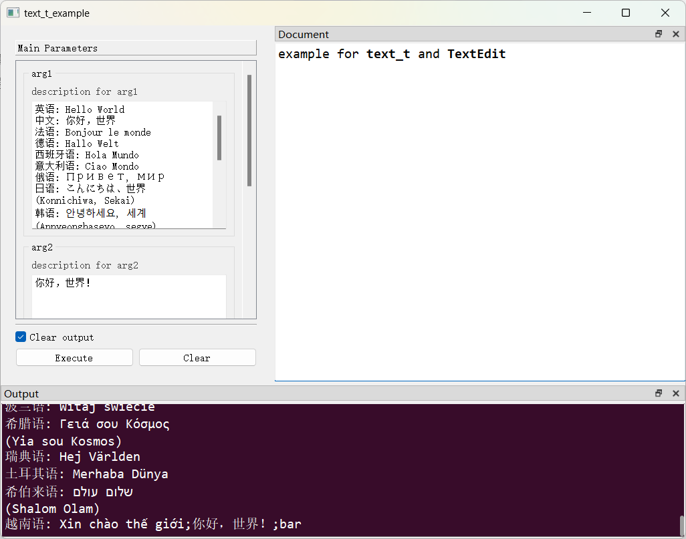

# `TextEdit`控件

## 一、控件类型：`TextEdit`

> 源码: [`pyguiadapter/widgets/extend/textedit.py`]()


`text_t`扩展自`str`，可以看作是`str`类型的别名。`PyGUIAdapter`为该类型提供了一个多行文本输入框，允许用户输入多行文本。

## 二、配置类型：`TextEditConfig`

> 源码: [`pyguiadapter/widgets/extend/textedit.py`]()

```python
@dataclasses.dataclass(frozen=True)
class TextEditConfig(CommonParameterWidgetConfig):
    default_value: str | None = ""
    placeholder: str = ""
    accept_rich_text: bool = False
    auto_formatting: AutoFormatting | None = None
    line_wrap: LineWrapMode = LineWrapMode.WidgetWidth
    line_wrap_column_or_width: int = 88
    word_wrap: WrapMode | None = None

    @classmethod
    def target_widget_class(cls) -> Type["TextEdit"]:
        return TextEdit

```

|         配置项名称          |           类型           |           默认值           |                         说明                         |
| :-------------------------: | :----------------------: | :------------------------: | :--------------------------------------------------: |
|       `default_value`       |      `str \| None`       |            `""`            |                      控件默认值                      |
|        `placeholder`        |          `str`           |            `""`            |                无文本时显示的占位文本                |
|     `accept_rich_text`      |          `bool`          |          `False`           |                    是否接受富文本                    |
|      `auto_formatting`      | `AutoFormatting \| None` |           `None`           |        是否自动格式化。为`None`意味保持默认。        |
|         `line_wrap`         |      `LineWrapMode`      | `LineWrapMode.WidgetWidth` |                     行包裹模式。                     |
| `line_wrap_column_or_width` |          `int`           |            `88`            | 当行包裹模式为固定宽度（列数）时，一行的宽度或列数。 |
|         `word_wrap`         |    `WrapMode \| None`    |           `None`           |         单词包裹模式。为`None`意味保持默认。         |

## 三、示例

> 源码：[examples/widgets/text_t_example.py]()

```python
from pyguiadapter.adapter import GUIAdapter
from pyguiadapter.adapter.uoutput import uprint
from pyguiadapter.types import text_t
from pyguiadapter.widgets import TextEditConfig


def text_t_example(arg1: text_t, arg2: text_t, arg3: text_t = "foo") -> str:
    """
    example for **text_t** and **TextEdit**

    @param arg1: description for arg1
    @param arg2: description for arg2
    @param arg3: description for arg3
    @return:

    @params
    [arg1]
    default_value = "Hello World"


    [arg2]
    default_value = "你好，世界！"


    @end

    """
    uprint("arg1:", arg1)
    uprint("arg2:", arg2)
    uprint("arg3:", arg3)
    return "{};{};{}".format(arg1, arg2, arg3)


if __name__ == "__main__":

    arg3_conf = TextEditConfig(
        # this will override the default_value defined in the function signature
        default_value="bar",
        placeholder="Please input some text here!",
    )

    adapter = GUIAdapter()
    adapter.add(
        text_t_example,
        widget_configs={"arg3": arg3_conf},
    )
    adapter.run()

```



---

[参数数据类型及其对应控件](widgets/types_and_widgets.md)