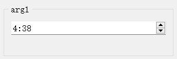

# `time`类型与`TimeEdit`控件

## 一、控件类型：`TimeEdit`

> 源码: [`pyguiadapter/widgets/extend/timeedit.py`]()

该控件用于输入日期，是python内置`datetime.time`类型参数的默认输入控件。



## 二、配置类型：`TimeEditConfig`

> 源码: [`pyguiadapter/widgets/extend/timeedit.py`]()

```python
@dataclasses.dataclass(frozen=True)
class TimeEditConfig(CommonParameterWidgetConfig):
    default_value: time | QTime | None = datetime.now().time()
    min_time: time | QTime | None = None
    max_time: time | QTime | None = None
    display_format: str | None = None
    time_spec: TimeSpec | None = None
    wrapping: bool = False
    frame: bool = True
    alignment: Alignment = Qt.AlignLeft | Qt.AlignVCenter
    button_symbols: ButtonSymbols | None = None
    correction_mode: CorrectionMode | None = None
    keyboard_tracking: bool = True
    accelerated: bool = False

    @classmethod
    def target_widget_class(cls) -> Type["TimeEdit"]:
        return TimeEdit


```

|    配置项名称    |          类型          |              默认值               |                   说明                    |
| :--------------: | :--------------------: | :-------------------------------: | :---------------------------------------: |
| `default_value`  | `time\| QTime\| None`  |      `datetime.now().time()`      |  控件的默认值，默认取运行时的当前时间。   |
|    `min_time`    | `time\| QTime\| None`  |              `None`               |           控件接受的最小时间。            |
|    `max_time`    | `time \| QTime\| None` |              `None`               |           控件接受的最大时间。            |
| `display_format` |     `str \| None`      |              `None`               |              时间显示格式。               |
|   `time_spec`    |   `TimeSpec \| None`   |              `None`               |              设置当前时区。               |
|    `wrapping`    |         `bool`         |              `False`              |            设置是否允许循环。             |
|     `frame`      |         `bool`         |              `True`               |              是否绘制边框。               |
|   `alignment`    |      `Alignment`       | ` Qt.AlignLeft \|Qt.AlignVCenter` | 设置对齐方式，默认`水平居左`+`垂直居中`。 |

## 三、示例

> 源码：[examples/widgets/time_example.py]()

```python
from datetime import time

from pyguiadapter.adapter import GUIAdapter
from pyguiadapter.adapter.ucontext import uprint
from pyguiadapter.widgets import TimeEditConfig


def time_example(arg1: time, arg2: time, arg3: time):
    """
    example for type **time** and **TimeEdit** widget
    """
    uprint("arg1:", arg1)
    uprint("arg2:", arg2)
    uprint("arg3:", arg3)


if __name__ == "__main__":
    arg1_conf = TimeEditConfig(
        default_value=time(hour=12, minute=30),
        max_time=time(hour=23, minute=59),
        min_time=time(hour=0, minute=0),
    )
    arg2_conf = TimeEditConfig(
        default_value=time(hour=20, minute=30),
        max_time=time(hour=23, minute=59),
        min_time=time(hour=12, minute=0),
    )
    adapter = GUIAdapter()
    adapter.add(
        time_example,
        widget_configs={
            "arg1": arg1_conf,
            "arg2": arg2_conf,
        },
    )
    adapter.run()

```


---

[参数数据类型及其对应控件](widgets/types_and_widgets.md)