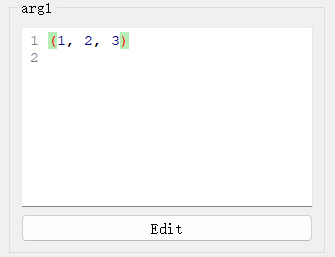

# `TupleEdit`控件

## 一、控件类型：`TupleEdit`

> 源码: [`pyguiadapter/widgets/basic/tupleedit.py`]()


`TupleEdit`是[`PyLiteralEdit`](widgets/any.md)的子类，主要用于Python列表类型数据的输入，是`tuple`、`typing.Tuple`等类型的函数参数的默认输入控件。

   

## 二、配置类型：`TupleEditConfig`

> 源码: [`pyguiadapter/widgets/basic/tupleedit.py`]()

```python
@dataclasses.dataclass(frozen=True)
class TupleEditConfig(PyLiteralEditConfig):
    default_value: tuple | None = dataclasses.field(default_factory=tuple)
    initial_text: str = "()"

    @classmethod
    def target_widget_class(cls) -> Type["TupleEdit"]:
        return TupleEdit
```

| 配置项名称      | 类型            | 默认值 |
| --------------- | --------------- | ------ |
| `default_value` | `tuple \| None` | `()`   |

`TupleEditConfig`继承自[`PyLiteralEditConfig`](widgets/any.md)，其可配置项，可以参考：

- [`PyLiteralEditConfig`](widgets/any.md)
- [`BaseCodeEditConfig`](widgets/base_code_edit.md)


## 三、示例

> 源码：[examples/widgets/tuple_example.py]()

```python
from typing import Tuple

from pyguiadapter.adapter import GUIAdapter
from pyguiadapter.adapter.ucontext import uprint
from pyguiadapter.widgets import TupleEditConfig


def tuple_example(arg1: tuple, arg2: Tuple, arg3: tuple):
    """
    example for **TupleEdit** for **tuple-like** types
    """
    uprint("arg1: ", arg1)
    uprint("arg2: ", arg2)
    uprint("arg3: ", arg3)


if __name__ == "__main__":
    arg1_conf = TupleEditConfig(
        default_value=(1, 2, 3),
    )
    arg2_conf = TupleEditConfig(
        default_value=("a", "b", 1, 2),
    )
    arg3_conf = {
        "default_value": (1, 2, 3, [1, 2, 3, 4]),
    }
    adapter = GUIAdapter()
    adapter.add(
        tuple_example,
        widget_configs={
            "arg1": arg1_conf,
            "arg2": arg2_conf,
            "arg3": arg3_conf,
        },
    )
    adapter.run()

```


---

[参数数据类型及其对应控件](widgets/types_and_widgets.md)