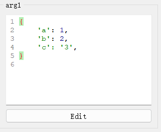
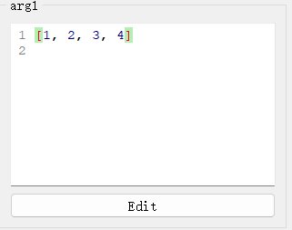
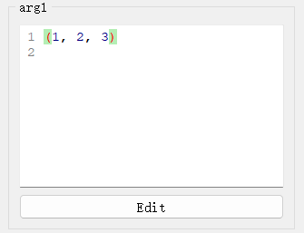
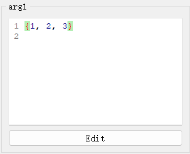
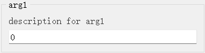
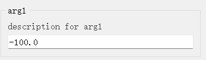
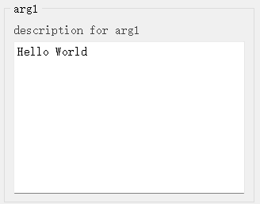

#  参数数据类型及其对应控件

### （一）Python内置类型的默认控件

|                  控件类型                  |        控件配置类型        |                    对应数据类型                    |                             说明                             |                   外观                    |
| :----------------------------------------: | :------------------------: | :------------------------------------------------: | :----------------------------------------------------------: | :---------------------------------------: |
|       [`IntSpinBox`](widgets/int.md)       |     `IntSpinBoxConfig`     |                       `int`                        |                   用于输入`int`类型数据。                    |      |
|     [`FloatSpinBox`](widgets/float.md)     |    `FloatSpinBoxConfig`    |                      `float`                       |                  用于输入`float`类型数据。                   |  |
|        [`BoolBox`](widgets/bool.md)        |      `BoolBoxConfig`       |                       `bool`                       |                   用于输入`bool`类型数据。                   |      |
|        [`LineEdit`](widgets/str.md)        |      `LineEditConfig`      |                       `str`                        |                   用于输入`str`类型数据。                    |    |
|       [`DictEdit`](widgets/dict.md)        |      `DictEditConfig`      | `dict`、`typing.Dict`、`Mapping`、`MutableMapping` |                   用于字典类型数据的输入。                   |                    |
|       [`ListEdit`](widgets/list.md)        |      `ListEditConfig`      |               `list`、`typing.List`                |                   用于列表类型数据的输入。                   |                    |
|      [`TupleEdit`](widgets/tuple.md)       |     `TupleEditConfig`      |              `tuple`、`typing.Tuple`               |                   用于元组类型数据的输入。                   |                   |
|       [`SetEdit`](../widgets/set.md)       |      `SetEditConfig`       |         `set`、`typing.Set`、`MutableSet`          |                   用于集合类型数据的输入。                   |                     |
|       [`DateEdit`](widgets/date.md)        |      `DateEditConfig`      |                       `date`                       | 该控件用于输入日期，是python内置`datetime.date`类型参数的默认输入控件。 |               |
|       [`TimeEdit`](widgets/time.md)        |      `TimeEditConfig`      |                       `time`                       | 该控件用于输入日期，是python内置`datetime.time`类型参数的默认输入控件。 |               |
|   [`DateTimeEdit`](widgets/datetime.md)    |    `DateTimeEditConfig`    |                     `datetime`                     | 该控件用于输入日期时间，是python内置`datetime.datetime`类型参数的默认输入控件。 |           |
| [`ExclusiveChoiceBox`](widgets/literal.md) | `ExclusiveChoiceBoxConfig` |                  `typing.Literal`                  | 用于从一组选项中选择一个选项，是`typing.Literal`类型的默认控件，可以自动提取`Literal`所有给定的字面量并将其作为可选项。 |    |
|     [`PyLiteralEdit`](widgets/any.md)      |   `PyLiteralEditConfig`    |       `typing.Any`、`object`、`typing.Union`       | `PyLiteralEdit`是[`BaseCodeEdit`](widgets/base_code_edit.md)的子类，主要用于Python字面量的输入，是`Any`、`object`、`Union`等类型的函数参数的默认输入控件。 `Python字面量`是指`ast.eval_literal()`函数支持任意Python字面量结构，包括：字符串、字节对象、数值、元组、列表、字典、集合、布尔值等。 |                     |
|      [`EnumSelect`](widgets/enum.md)       |     `EnumSelectConfig`     |                    `enum.Enum`                     |                用于`Enum`（枚举类型）值的输入                |              |

### （二）语义化类型（扩展类型）及其控件

`语义化类型`是从Python内置类型中扩展而来的类型，可以看作对应内置类型的`“别名”`，在使用上与对应内置类型没有区别。其主要作用在于，提供区别于对应内置类型的控件，以满足特定场景下的输入需求。比如`int_slider_t`是内置`int`类型的语义化类型（扩展类型），在使用上与`int`类型完全一致，但它提供了一个类似滑动条的输入控件，而不是`IntSpinBox`。通过合理使用语义化类型，开发者可以构建出界面更加丰富，用户交互体验更佳的应用程序。

以下是`PyGUIAdapter`提供的语义化类型及其对应的控件类型列表。开发者可以跳转到对应的页面，查看控件的用法和使用示例。

> `PyGUIAdapter`提供的语义化类型在：[pyguiadapter/types]()中定义。

|                    控件类型                    |      控件配置类型       |      对应数据类型      |                             说明                             |            外观            |
| :--------------------------------------------: | :---------------------: | :--------------------: | :----------------------------------------------------------: | :------------------------: |
|       [`IntLineEdit`](widgets/int_t.md)        |   `IntLineEditConfig`   |        `int_t`         | `int_t`扩展自`int`，可以看作是`int`类型的别名。`PyGUIAdapter`为该类型提供了一个单行文本输入框样式的输入组件，但于与一般单行文本输入框标题，该类型的输入组件只允许用户输入整数文本。 |    |
|     [`FloatLineEdit`](widgets/float_t.md)      |  `FloatLineEditConfig`  |       `float_t`        | `float_t`扩展自`float`，可以看作是`float`类型的别名。`PyGUIAdapter`为该类型提供了一个单行文本输入框样式的输入组件，但于与一般单行文本输入框标题，该类型的输入组件只允许用户输入浮点数文本。 |  |
|        [`TextEdit`](widgets/text_t.md)         |    `TextEditConfig`     |        `text_t`        | `text_t`扩展自`str`，可以看作是`str`类型的别名。`PyGUIAdapter`为该类型提供了一个多行文本输入框，允许用户输入多行文本。 |   |
|      [`Slider`](widgets/int_slider_t.md)       |     `SliderConfig`      |     `int_slider_t`     |                                                              |                            |
|        [`Dial`](widgets/int_dial_t.md)         |      `DialConfig`       |      `int_dial_t`      |                                                              |                            |
| [`ColorTuplePicker`](widgets/color_tuple_t.md) |   `ColorPickerConfig`   |    `color_tuple_t`     |                                                              |                            |
|   [`ColorHexPicker`](widgets/color_hex_t.md)   |   `ColorPickerConfig`   |     `color_hex_t`      |                                                              |                            |
|       [`ChoiceBox`](widgets/choice_t.md)       |    `ComboBoxConfig`     |       `choice_t`       |                                                              |                            |
| [`KeySequenceEdit`](widgets/key_sequence_t.md) | `KeySequenceEditConfig` |    `key_sequence_t`    |                                                              |                            |
|    [`MultiChoiceBox`](widgets/choices_t.md)    | `MultiChoiceBoxConfig`  |      `choices_t`       |                                                              |                            |
|   [`PlainDictEdit`](widgets/plain_dict_t.md)   |  `PlainDictEditConfig`  |     `plain_dict_t`     |                                                              |                            |
|  [`StringListEdit`](widgets/string_list_t.md)  | `StringListEditConfig`  |    `string_list_t`     |                                                              |                            |
|        [`JsonEdit`](widgets/json_obj_t)        |    `JsonEditConfig`     |      `json_obj_t`      |                                                              |                            |
|        [`DirSelect`](widgets/dir_t.md)         |    `DirSelectConfig`    | `directory_t`、`dir_t` |                                                              |                            |
|       [`FileSelect`](widgets/file_t.md)        |   `FileSelectConfig`    |        `file_t`        |                                                              |                            |
|    [`MultiFileSelect`](widgets/files_t.md)     | `MultiFileSelectConfig` |       `files_t`        |                                                              |                            |

