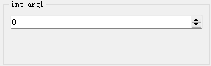
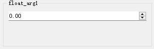
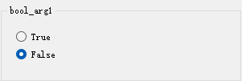
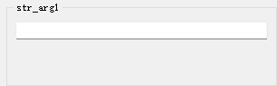
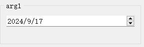
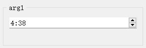
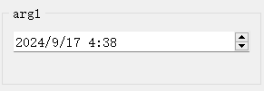
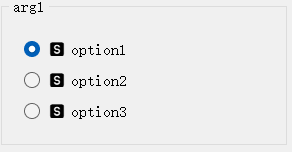
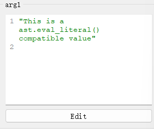
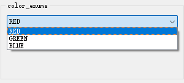

#  参数数据类型及其对应控件

### （一）Python内置类型的默认控件

|                  控件类型                  |        控件配置类型        |              对应数据类型              |                             说明                             |                   外观                    |
| :----------------------------------------: | :------------------------: | :------------------------------------: | :----------------------------------------------------------: | :---------------------------------------: |
|       [`IntSpinBox`](widgets/int.md)       |     `IntSpinBoxConfig`     |                 `int`                  |                    用于输入`int`类型数据                     |      |
|     [`FloatSpinBox`](widgets/float.md)     |    `FloatSpinBoxConfig`    |                `float`                 |                   用于输入`float`类型数据                    |  |
|        [`BoolBox`](widgets/bool.md)        |      `BoolBoxConfig`       |                 `bool`                 |                    用于输入`bool`类型数据                    |      |
|        [`LineEdit`](widgets/str.md)        |      `LineEditConfig`      |                 `str`                  |                    用于输入`str`类型数据                     |    |
|               [`DictEdit`]()               |      `DictEditConfig`      |       `dict`、`typing.TypedDict`       |                                                              |                                           |
|               [`ListEdit`]()               |      `ListEditConfig`      |                 `list`                 |                                                              |                                           |
|              [`TupleEdit`]()               |     `TupleEditConfig`      |                `tuple`                 |                                                              |                                           |
|               [`SetEdit`]()                |      `SetEditConfig`       |                 `set`                  |                                                              |                                           |
|       [`DateEdit`](widgets/date.md)        |      `DateEditConfig`      |                 `date`                 | 该控件用于输入日期，是python内置`datetime.date`类型参数的默认输入控件。 |               |
|       [`TimeEdit`](widgets/time.md)        |      `TimeEditConfig`      |                 `time`                 | 该控件用于输入日期，是python内置`datetime.time`类型参数的默认输入控件。 |               |
|   [`DateTimeEdit`](widgets/datetime.md)    |    `DateTimeEditConfig`    |               `datetime`               | 该控件用于输入日期时间，是python内置`datetime.datetime`类型参数的默认输入控件。 |           |
| [`ExclusiveChoiceBox`](widgets/literal.md) | `ExclusiveChoiceBoxConfig` |            `typing.Literal`            | 用于从一组选项中选择一个选项，是`typing.Literal`类型的默认控件，可以自动提取`Literal`所有给定的字面量并将其作为可选项。 |    |
|     [`PyLiteralEdit`](widgets/any.md)      |   `PyLiteralEditConfig`    | `typing.Any`、`object`、`typing.Union` | `PyLiteralEdit`是[`BaseCodeEdit`](widgets/base_code_edit.md)的子类，主要用于Python字面量的输入，是`Any`、`object`、`Union`等类型的函数参数的默认输入控件。 `Python字面量`是指`ast.eval_literal()`函数支持任意Python字面量结构，包括：字符串、字节对象、数值、元组、列表、字典、集合、布尔值等。 |                     |
|      [`EnumSelect`](widgets/enum.md)       |     `EnumSelectConfig`     |              `enum.Enum`               |                用于`Enum`（枚举类型）值的输入                |              |

### （二）语义化类型（扩展类型）及其控件

|       控件类型        |      控件配置类型       | 对应数据类型 | 说明 | 外观 |
| :-------------------: | :---------------------: | :----------: | :--: | :--: |
|   [`IntLineEdit`]()   |   `IntLineEditConfig`   |              |      |      |
|  [`FloatLineEdit`]()  |  `FloatLineEditConfig`  |              |      |      |
|     [`Slider`]()      |     `SliderConfig`      |              |      |      |
|      [`Dial`]()       |      `DialConfig`       |              |      |      |
|   [`ColorPicker`]()   |   `ColorPickerConfig`   |              |      |      |
|    [`ComboBox`]()     |    `ComboBoxConfig`     |              |      |      |
| [`KeySequenceEdit`]() | `KeySequenceEditConfig` |              |      |      |
| [`MultiChoiceBox`]()  | `MultiChoiceBoxConfig`  |              |      |      |
|  [`PlainDictEdit`]()  |  `PlainDictEditConfig`  |              |      |      |
| [`StringListEdit`]()  | `StringListEditConfig`  |              |      |      |
|    [`JsonEdit`]()     |    `JsonEditConfig`     |              |      |      |
|    [`DirSelect`]()    |    `DirSelectConfig`    |              |      |      |
|   [`FileSelect`]()    |   `FileSelectConfig`    |              |      |      |
| [`MultiFileSelect`]() | `MultiFileSelectConfig` |              |      |      |

