## （一）窗口概述

`PyGUIAdapter`中主要有两种类型的窗口：`函数选择窗口（FnSelectWindow）`和`函数执行窗口（FnExecuteWindow）`，它们都继承自窗口父类[`BaseWindow`]({{main_branch}}/pyguiadapter/window.py)。`BaseWindow`定义了子类窗口的共同行为，比如：

- 开发者可以使用`窗口配置类`配置窗口的某些属性
- 开发者可以向窗口中添加工具栏和菜单栏
- 开发者可以监听窗口的某些事件
- 开发者可以在窗口事件回调中获取/改变添加到工具栏（菜单栏）中的`动作（Action）`的状态
- ......

### 1、窗口的基本接口

同时， `BaseWindow`中定义并实现了一组基本接口，这些接口可以对窗口进行操作或者是实现了其他有用的功能，开发者可以在`动作（Action）`或窗口事件的回调函数中调用这些接口。可以参考这个文档[`pyguiadapter.window.BaseWindow`](apis/pyguiadapter.window.md#pyguiadapter.window.BaseWindow)以获取这些接口的详细信息。

### 2、窗口的共同属性

窗口的属性，如标题、图标、大小、位置、字体、样式等，均由窗口的配置类定义，[`BaseWindowConfig`]({{main_branch}}/pyguiadapter/window.py)是所有窗口配置类的父类，定义了一组所有窗口均适用的共同属性，可以参考这个文档[`pyguiadapter.window.BaseWindowConfig`](apis/pyguiadapter.window.md#pyguiadapter.window.BaseWindowConfig)以获取这些属性的详细信息。

 `BaseWindow`的子类窗口通常继承`BaseWindowConfig`实现专用的窗口配置类，并覆盖`BaseWindowConfig`中某些属性的默认值或添加专门适用于子类窗口的新属性。

### 3、窗口事件监听

窗口的创建、显示、关闭、销毁、隐藏均被视为一种事件，开发者可以监听这些事件，并在这些事件发生时执行特定的代码。对窗口事件的监听，需要通过[`BaseWindowEventListener`]({{main_branch}}/pyguiadapter/window.py)对象来完成，开发者可以子类化该类，或者使用一个它的一个现成子类[`SimpleWindowEventListener`]({{main_branch}}/pyguiadapter/window.py)。

可以参考以下文档获取窗口事件监听器的详细信息：

- [`pyguiadapter.window.BaseWindowEventListener`](apis/pyguiadapter.window.md#pyguiadapter.window.BaseWindowEventListener)
- [`pyguiadapter.window.SimpleWindowEventListener`](apis/pyguiadapter.window.md#pyguiadapter.window.SimpleWindowEventListener)

## （二）函数选择窗口（FnSelectWindow）

### 1、概述

在向`GUIAdapter`实例中添加了多个函数后，`PyGUIAdapter`将创建一个`函数选择窗口`，该窗口会显示所有已添加的函数。在仅添加了一个函数时，`函数选择窗口`将不会显示，而是直接显示该函数的执行窗口，当然，开发者也可以通过如下方式，强制显示`函数选择窗口`：

```python
adapter.run(show_select_window=True)
```

`函数选择窗口`主要分成三个区域：

- ①`函数列表区域`
- ②`函数文档区域`
- ③`函数选择按钮`

<div style="text-align:center">
    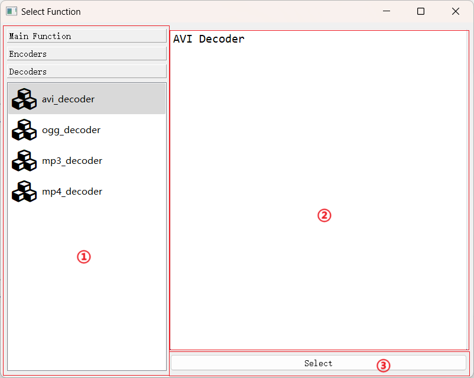
</div>

### 2、配置窗口属性

`函数选择窗口（FnSelectWindow）`的可配置属性由`FnSelectWindowConfig`类定义，开发者可以通过以下方法配置窗口属性：


<div style="text-align:center">
    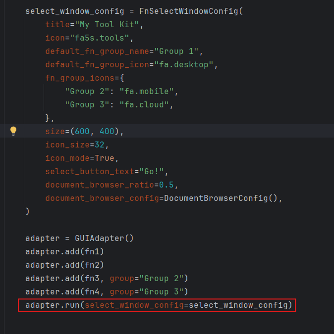
</div>
完整代码如下：

```python
from pyguiadapter.adapter import GUIAdapter
from pyguiadapter.windows import DocumentBrowserConfig
from pyguiadapter.windows.fnselect import FnSelectWindowConfig


def fn1():
    """
    This example shows how config the **function select window**
    """
    pass


def fn2():
    """
    This example shows how config the **function select window**
    """
    pass


def fn3():
    """
    This example shows how config the **function select window**
    """
    pass


def fn4():
    """
    This example shows how config the **function select window**
    """
    pass


if __name__ == "__main__":
    select_window_config = FnSelectWindowConfig(
        title="My Tool Kit",
        icon="fa5s.tools",
        default_fn_group_name="Group 1",
        default_fn_group_icon="fa.desktop",
        fn_group_icons={
            "Group 2": "fa.mobile",
            "Group 3": "fa.cloud",
        },
        size=(600, 400),
        icon_size=32,
        icon_mode=True,
        select_button_text="Go!",
        document_browser_width=400,
        document_browser_config=DocumentBrowserConfig(),
        always_on_top=True,
    )

    adapter = GUIAdapter()
    adapter.add(fn1)
    adapter.add(fn2)
    adapter.add(fn3, group="Group 2")
    adapter.add(fn4, group="Group 3")
    adapter.run(select_window_config=select_window_config)
```

<div style="text-align: center">
    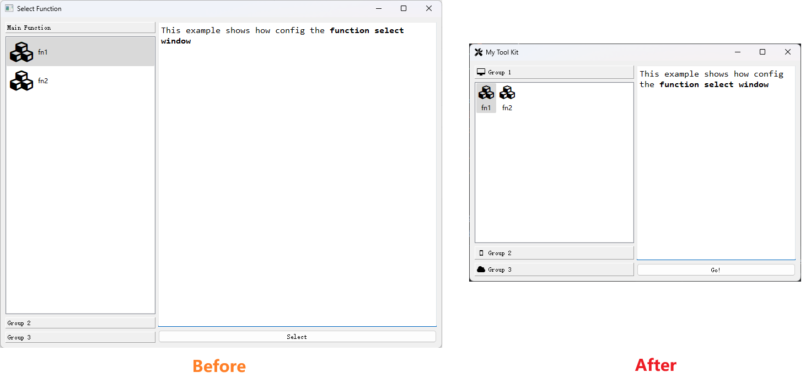
</div>

<div style="text-align: center">
    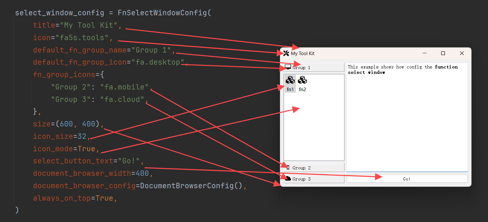
</div>


关于`函数选择窗口（FnSelectWindow）`的可配置属性，可参考以下文档：

- [pyguiadapter.windows.fnselect.FnSelectWindowConfig](apis/pyguiadapter.windows.fnselect.md#pyguiadapter.windows.fnselect.FnSelectWindowConfig)

### 3、监听窗口事件

开发者可以对`函数选择窗口（FnSelectWindow）`的事件进行监听。方法如下：

<div style="text-align: center">
    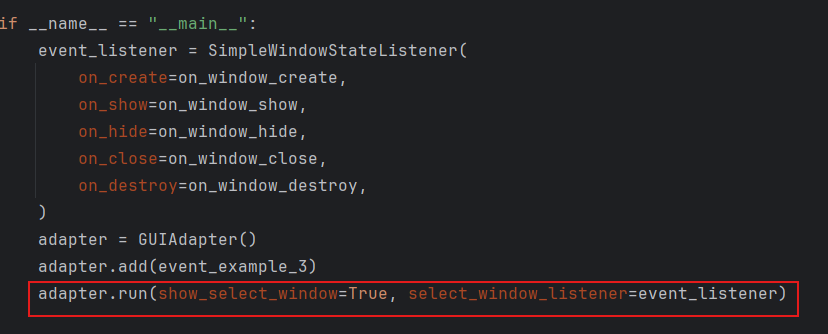
</div>

完整代码如下：

```python
from pyguiadapter.adapter import GUIAdapter
from pyguiadapter.utils import messagebox
from pyguiadapter.window import SimpleWindowEventListener
from pyguiadapter.windows.fnselect import FnSelectWindow


def on_window_create(window: FnSelectWindow):
    print("on_create")


def on_window_show(window: FnSelectWindow):
    print("on_show")


def on_window_hide(window: FnSelectWindow):
    print("on_hide")


def on_window_close(window: FnSelectWindow) -> bool:
    print("on_close")
    ret = messagebox.show_question_message(
        window,
        title="Confirm Quit",
        message="Are you sure to quit?",
        buttons=messagebox.Yes | messagebox.No,
    )
    if ret == messagebox.Yes:
        return True
    return False


def on_window_destroy(window: FnSelectWindow):
    print("on_destroy")


def event_example_3():
    pass


if __name__ == "__main__":
    event_listener = SimpleWindowEventListener(
        on_create=on_window_create,
        on_show=on_window_show,
        on_hide=on_window_hide,
        on_close=on_window_close,
        on_destroy=on_window_destroy,
    )
    adapter = GUIAdapter()
    adapter.add(event_example_3)
    adapter.run(show_select_window=True, select_window_listener=event_listener)

```

代码运行效果如下：

<div style="text-align: center">
    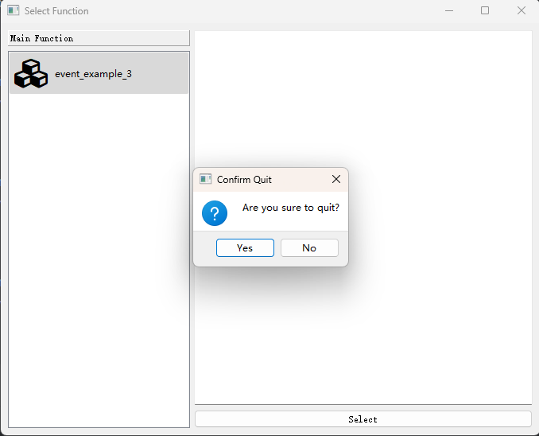
</div>

控制台输出如下：

<div style="text-align: center">
    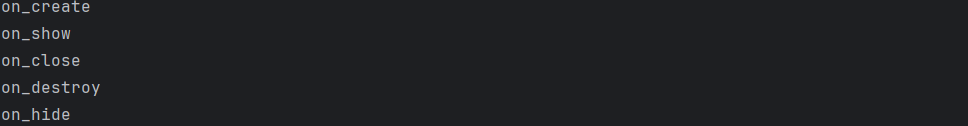
</div>

### 4、添加工具栏

开发者可以向`函数选择窗口（FnSelectWindow）`中添加工具栏，方法如下：

<div style="text-align: center">
    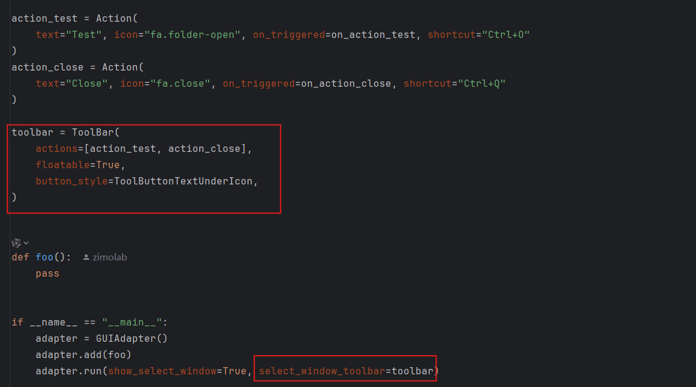
</div>

完整代码如下：

```python
from pyguiadapter.action import Action
from pyguiadapter.adapter import GUIAdapter
from pyguiadapter.toolbar import ToolBar, ToolButtonTextUnderIcon
from pyguiadapter.utils import messagebox
from pyguiadapter.windows.fnselect import FnSelectWindow


def on_action_test(window: FnSelectWindow, action: Action):
    messagebox.show_info_message(
        window, message=f"Action Triggered!(Action: {action.text})"
    )


def on_action_close(window: FnSelectWindow, _: Action):
    ret = messagebox.show_question_message(
        window,
        message="Are you sure to close the application?",
        buttons=messagebox.Yes | messagebox.No,
    )
    if ret == messagebox.Yes:
        window.close()


action_test = Action(
    text="Test", icon="fa.folder-open", on_triggered=on_action_test, shortcut="Ctrl+O"
)
action_close = Action(
    text="Close", icon="fa.close", on_triggered=on_action_close, shortcut="Ctrl+Q"
)

toolbar = ToolBar(
    actions=[action_test, action_close],
    floatable=True,
    button_style=ToolButtonTextUnderIcon,
)


def foo():
    pass


if __name__ == "__main__":
    adapter = GUIAdapter()
    adapter.add(foo)
    adapter.run(show_select_window=True, select_window_toolbar=toolbar)

```

效果如下：

<div style="text-align: center">
    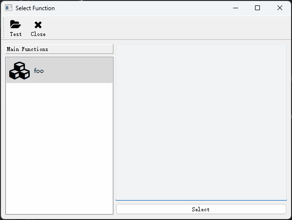
</div>

### 5、添加窗口菜单

开发者可以向`函数选择窗口（FnSelectWindow）`中添加菜单栏，方法如下：

<div style="text-align: center">
    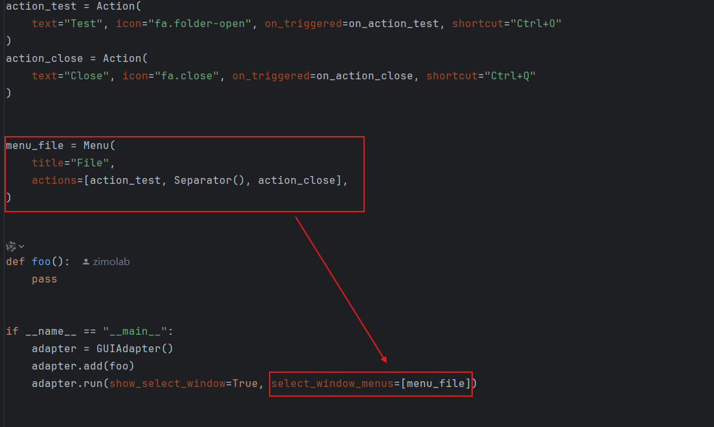
</div>

完整示例代码如下：

```python
from pyguiadapter.action import Action, Separator
from pyguiadapter.adapter import GUIAdapter
from pyguiadapter.menu import Menu
from pyguiadapter.utils import messagebox
from pyguiadapter.windows.fnselect import FnSelectWindow


def on_action_test(window: FnSelectWindow, action: Action):
    messagebox.show_info_message(
        window, message=f"Action Triggered!(Action: {action.text})"
    )


def on_action_close(window: FnSelectWindow, _: Action):
    ret = messagebox.show_question_message(
        window,
        message="Are you sure to close the application?",
        buttons=messagebox.Yes | messagebox.No,
    )
    if ret == messagebox.Yes:
        window.close()


action_test = Action(
    text="Test", icon="fa.folder-open", on_triggered=on_action_test, shortcut="Ctrl+O"
)
action_close = Action(
    text="Close", icon="fa.close", on_triggered=on_action_close, shortcut="Ctrl+Q"
)


menu_file = Menu(
    title="File",
    actions=[action_test, Separator(), action_close],
)


def foo():
    pass


if __name__ == "__main__":
    adapter = GUIAdapter()
    adapter.add(foo)
    adapter.run(show_select_window=True, select_window_menus=[menu_file])

```

效果如下：

<div style="text-align: center">
    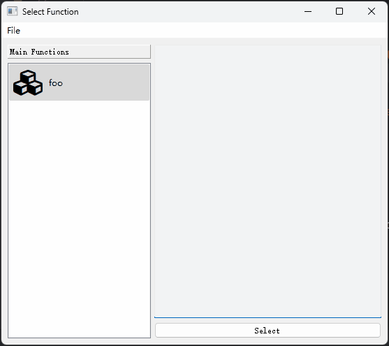
</div>

### 6、主要接口

参考：[pyguiadapter.windows.fnselect.FnSelectWindow](apis/pyguiadapter.windows.fnselect.md#pyguiadapter.windows.fnselect.FnSelectWindow)。

## （三）函数执行窗口（FnExecuteWindow）

### 1、概述

`函数执行窗口（FnExecuteWindow）`是用户与程序进行交互的主要界面。一个典型的`函数执行窗口（FnExecuteWindow）`由以下几个部分组成：

<div style="text-align: center">
    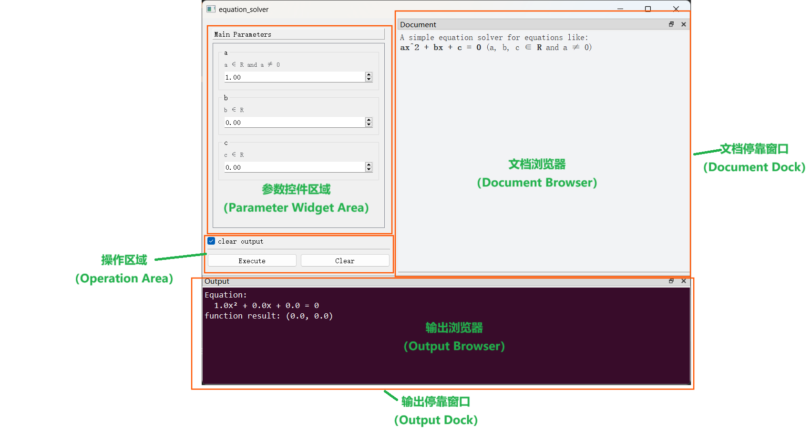
</div>

其中：

- **文档浏览器**用于显示函数说明文档。
- **输出浏览器**用于显示函数运行过程中使用输出的消息。默认情况下，函数的返回值、函数的异常信息均会显示在此区域。


### 2、配置窗口属性

`函数执行窗口（FnExecuteWindow）`的窗口属性由配置类`FnExecuteWindowConfig`定义，开发者可以通过`GUIAdapter.add()`方法的`window_config`配置窗口的属性，每个函数都可以根据需要配置自己的窗口属性，例如，在下面的例子中，`function_1`和`function_2`分别配置了不同的窗口属性：

```python
from pyguiadapter.adapter import GUIAdapter
from pyguiadapter.windows.fnexec import FnExecuteWindowConfig


def function_1(arg1: int, arg2: str, arg3: bool) -> None:
    pass


def function_2(arg1: int, arg2: str, arg3: bool) -> None:
    pass


if __name__ == "__main__":
    adapter = GUIAdapter()
    adapter.add(function_1, window_config=FnExecuteWindowConfig(
        title="Function 1", clear_checkbox_visible=True
    ))
    adapter.add(function_2, window_config=FnExecuteWindowConfig(
        title="Function 2",
        size=(400, 600),
        clear_checkbox_visible=False,
        clear_checkbox_checked=False,
        document_dock_visible=False,
    ))
    adapter.run()

```

<div style="text-align: center">
    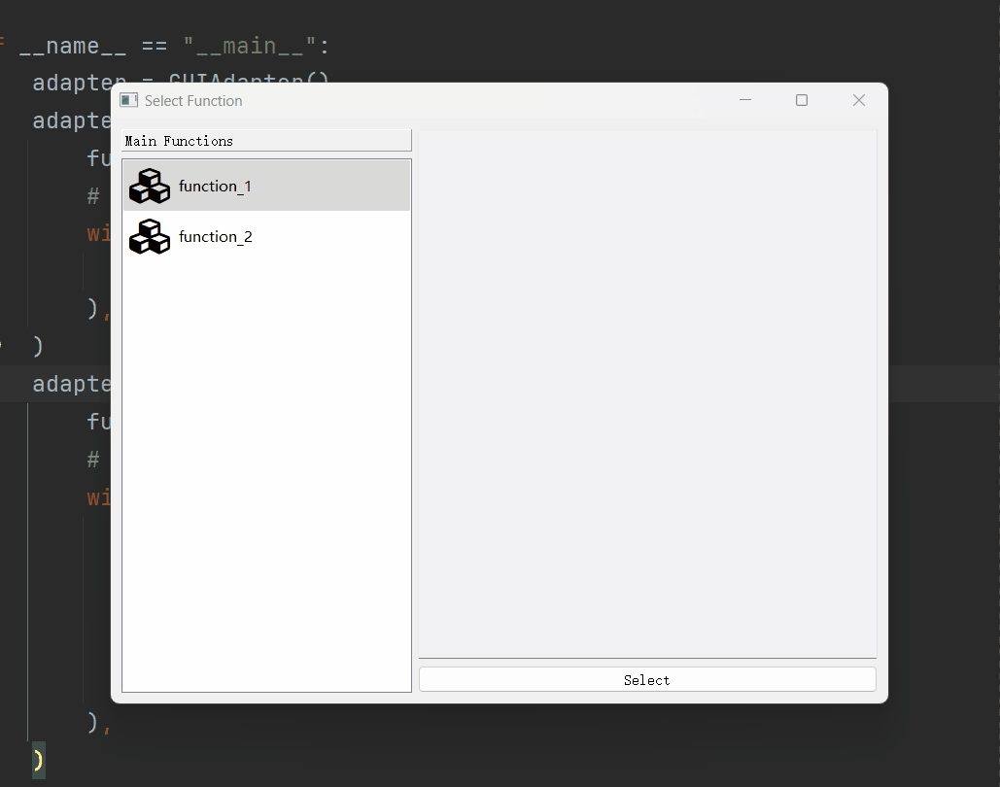
</div>


下面是一个更加复杂一些的例子，演示了更多可配置属性的效果：

```python
from typing import Optional

from pyguiadapter.adapter import GUIAdapter
from pyguiadapter.exceptions import ParameterError
from pyguiadapter.windows.fnexec import FnExecuteWindowConfig


def equation_solver(a: float, b: float, c: float) -> Optional[tuple]:
    """
    Solving Equations: ax^2 + bx + c = 0 (a,b,c ∈ R, a ≠ 0)
    @param a: a ∈ R, a ≠ 0
    @param b: b ∈ R
    @param c: c ∈ R
    @return:
    """
    if a == 0:
        raise ParameterError(parameter_name="a", message="a cannot be zero!")

    delta = b ** 2 - 4 * a * c
    if delta < 0:
        return None
    x1 = (-b + delta ** 0.5) / (2 * a)
    if delta == 0:
        return x1, x1
    x2 = (-b - delta ** 0.5) / (2 * a)
    return x1, x2


if __name__ == "__main__":
    window_config = FnExecuteWindowConfig(
        title="Equation Solver",
        icon="mdi6.function-variant",
        execute_button_text="Solve",
        size=(350, 450),
        document_dock_visible=False,
        output_dock_visible=False,
        clear_button_visible=False,
        clear_checkbox_visible=False,
        show_function_result=True,
        function_result_message="real roots: {}",
        default_parameter_group_name="Equation Parameters",
        print_function_error=False,
        print_function_result=False,
    )
    adapter = GUIAdapter()
    adapter.add(equation_solver, window_config=window_config)
    adapter.run()

```

<div style="text-align: center">
    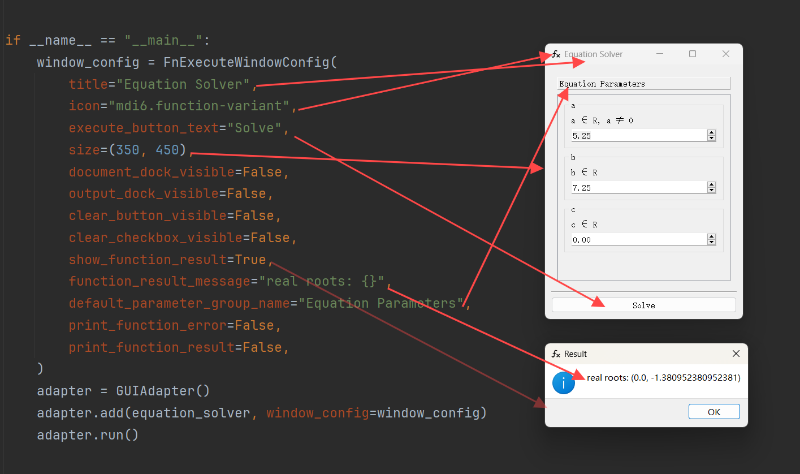
</div>


`函数执行窗口（FnExecuteWindow）`拥有丰富的可配置选项，可以参考以下文档获得这些选项的详细信息：

- [pyguiadapter.windows.fnexec.FnExecuteWindowConfig](apis/pyguiadapter.windows.fnexec.md#pyguiadapter.windows.fnexec.FnExecuteWindowConfig)。

  

关于文档浏览器的配置，可以参考以下文档：

- [pyguiadapter.windows.DocumentBrowserConfig](apis/pyguiadapter.windows.md#pyguiadapter.windows.DocumentBrowserConfig)。

  

关于输出浏览器的配置，可以参考以下文档：

- [pyguiadapter.windows.fnexec.OutputBrowserConfig](apis/pyguiadapter.windows.fnexec.md#pyguiadapter.windows.fnexec.OutputBrowserConfig)。


>  **Q&A： 为什么设置了`DocumentBrowserConfig`和`OutputBrowserConfig`，但有时不生效？**
>
>  这种情况常见于开发者为窗口设置了样式表（QSS）或使用了第三方美化库时。由于样式表的优先级要高于`DocumentBrowserConfig`和`OutputBrowserConfig`，因此可能会发生`DocumentBrowserConfig`或`OutputBrowserConfig`中设置的样式（如文字颜色、背景色等）被样式表覆盖掉的情况。这种设计的目的是为了让界面的整体风格保持一致。
>
>  比如下面这个例子，通过第三方库设置了窗口主题后，文档浏览器和输出浏览器的文字颜色、背景颜色也会被调整到合适的状态。
>
>  ````python
>  """
>  This example requires PyQtDarkTheme. Please install it before you run this example.
>  """
>  
>  from datetime import datetime
>  
>  from pyguiadapter.adapter import GUIAdapter
>  from pyguiadapter.extend_types import text_t
>  
>  
>  def app_style_example(
>      arg1: str, arg2: int, arg3: float, arg4: bool, arg5: text_t, arg6: datetime
>  ):
>      """
>      This example requires [PyQtDarkTheme](https://github.com/5yutan5/PyQtDarkTheme).
>      Please install it before you run the example.
>  
>      <br />
>      
>      e.g. using `pip`:
>      
>      > `pip install pyqtdarktheme`
>      
>      @param arg1: arg1 description
>      @param arg2: arg2 description
>      @param arg3: arg3 description
>      @param arg4: arg4 description
>      @param arg5: arg5 description
>      @param arg6: arg6 description
>      @return:
>      """
>      pass
>  
>  
>  if __name__ == "__main__":
>      import qdarktheme
>  
>      def on_app_start(app):
>          # this will be called after the instantiation of QApplication.
>          print("app started")
>          qdarktheme.setup_theme("dark")
>      
>      adapter = GUIAdapter(on_app_start=on_app_start)
>      adapter.add(app_style_example)
>      adapter.run()
>  ```
>  ````
>
>  <div style="text-align: center">
>      
>  </div>
>
>  如果开发者确实需要设置文档浏览器或输出浏览器的样式，而不希望它被第三方库覆盖，可以通过`DocumentBrowserConfig`或`OutputBrowserConfig`的`stylesheet`属性指定其样式表内容，通过`stylesheet`设置的样式一般不会被第三方库覆盖。比如下面的示例：
>
>  ```python
>  """
>  This example requires PyQtDarkTheme. Please install it before you run this example.
>  """
>  
>  from datetime import datetime
>  
>  from pyguiadapter.adapter import GUIAdapter
>  from pyguiadapter.extend_types import text_t
>  from pyguiadapter.windows.fnexec import FnExecuteWindowConfig, OutputBrowserConfig
>  
>  
>  def app_style_example(
>      arg1: str, arg2: int, arg3: float, arg4: bool, arg5: text_t, arg6: datetime
>  ):
>      """
>      This example requires [PyQtDarkTheme](https://github.com/5yutan5/PyQtDarkTheme).
>      Please install it before you run the example.
>      <br />
>  
>      e.g. using `pip`:
>  
>      > `pip install pyqtdarktheme`
>  
>      <br />
>  
>      The style of output browser will be overridden with **OutputBrowserConfig.stylesheet**
>  
>      @param arg1: arg1 description
>      @param arg2: arg2 description
>      @param arg3: arg3 description
>      @param arg4: arg4 description
>      @param arg5: arg5 description
>      @param arg6: arg6 description
>      @return:
>      """
>      pass
>  
>  
>  if __name__ == "__main__":
>      import qdarktheme
>  
>      def on_app_start(app):
>          # this will be called after the instantiation of QApplication.
>          print("app started")
>          qdarktheme.setup_theme("dark")
>  
>      adapter = GUIAdapter(on_app_start=on_app_start)
>      adapter.add(
>          app_style_example,
>          window_config=FnExecuteWindowConfig(
>              output_browser_config=OutputBrowserConfig(
>                  stylesheet="""
>                  background-color: "#380C2A";
>                  color: "#FFFFFF";
>                  font-family: "Consolas";
>                  font-size: 12pt;
>                  """
>              )
>          ),
>      )
>      adapter.run()
>  ```
>
>  <div style="text-align: center">
>      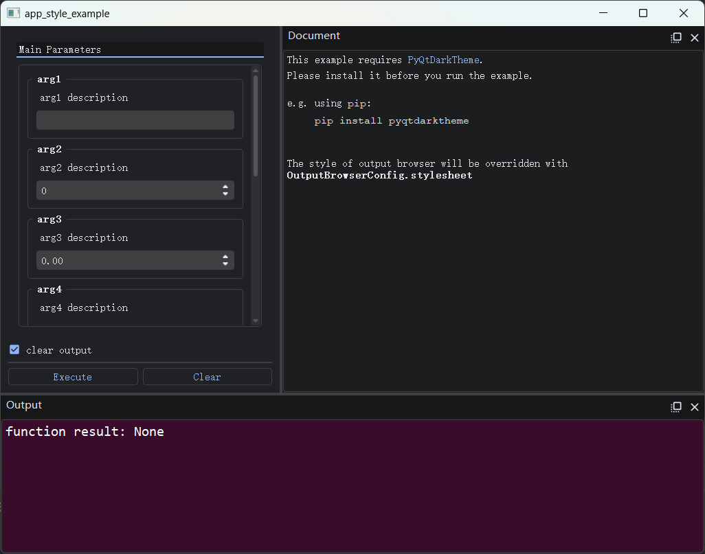
>  </div>


### 3、监听窗口事件

开发者可以对`（函数执行窗口）FnExecuteWindow`的事件进行监听并做出响应，一个比较常见的场景是，在用户关闭窗口时再次向用户进行确认。监听窗口事件的方法如下：

<div style="text-align: center">
    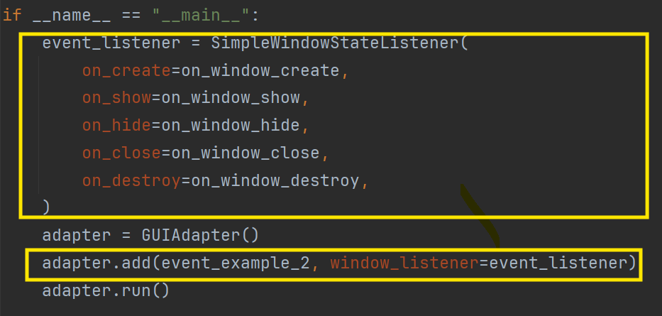
</div>

```python
from pyguiadapter.adapter import GUIAdapter
from pyguiadapter.window import SimpleWindowEventListener
from pyguiadapter.windows.fnexec import FnExecuteWindow
from pyguiadapter.utils import messagebox


def on_window_create(window: FnExecuteWindow):
    print("on_create")


def on_window_show(window: FnExecuteWindow):
    print("on_show")


def on_window_hide(window: FnExecuteWindow):
    print("on_hide")


def on_window_close(window: FnExecuteWindow) -> bool:
    print("on_close")
    ret = messagebox.show_question_message(
        window,
        title="Confirm Quit",
        message="Are you sure to quit?",
        buttons=messagebox.Yes | messagebox.No,
    )
    if ret == messagebox.Yes:
        return True
    return False


def on_window_destroy(window: FnExecuteWindow):
    print("on_destroy")


def event_example_2():
    pass


if __name__ == "__main__":
    event_listener = SimpleWindowEventListener(
        on_create=on_window_create,
        on_show=on_window_show,
        on_hide=on_window_hide,
        on_close=on_window_close,
        on_destroy=on_window_destroy,
    )
    adapter = GUIAdapter()
    adapter.add(event_example_2, window_listener=event_listener)
    adapter.run()
```

上述示例效果如下：

<div style="text-align: center">
    
</div>

控制台输出如下：

<div style="text-align: center">
    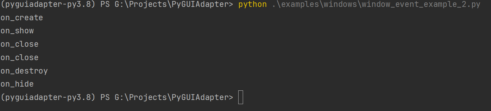
</div>


除了可以使用[`BaseWindowEventListener`](apis/pyguiadapter.window.md#pyguiadapter.window.BaseWindowEventListener)或[`SimpleWindowEventListener`](apis/pyguiadapter.window.md#pyguiadapter.window.SimpleWindowEventListener)对函数执行窗口的事件进行监听，还可以使用函数执行窗口专用的事件监听器类：`FnExecuteWindowEventListener`或`SimpleFnExecuteWindowEventListener`。除了可以监听一般的窗口事件，它们还能对函数执行状态进行监听，包括：

- 函数开始执行，此时将会回调`on_execute_start()`
- 函数正常返回，此时将会回调`on_execute_result()`
- 函数执行过程中发生异常，函数未正常返回，此时将回调`on_execute_error()`
- 函数执行完毕，此时将会回调`on_execute_finish()`，由于不管函数是否正常返回，其最终都会回到该状态， 因此，可以保证在`on_execute_result()`或`on_execute_error()`回调之后`on_execute_finish()`一定会被回调


在上述事件回调函数中，比较特殊的是`on_execute_result()`和`on_execute_error()`。这两个回调函数返回一个`bool`值，其作用是告诉`PyGUIAdapter`是否要对函数的返回值或异常执行默认的处理逻辑。若返回`True`，则`PyGUIAdapter`将在函数返回或发生异常后执行默认的操作，比如打印或弹窗显示返回值或异常信息。若返回`False`，则表示开发者已经在回调函数中完成了对函数返回值/异常处理，无需`PyGUIAdapter`再次进行处理。

开发者可以查看以下文档，获取`FnExecuteWindowEventListener`或`SimpleFnExecuteWindowEventListener`的详细信息：

- [`FnExecuteWindowEventListener`](apis/pyguiadapter.windows.fnexec.md#pyguiadapter.windows.fnexec.FnExecuteWindowEventListener)
- [`SimpleFnExecuteWindowEventListener`](apis/pyguiadapter.windows.fnexec.md#pyguiadapter.windows.fnexec.SimpleFnExecuteWindowEventListener)


下面是一个简单的示例：

```python
from pyguiadapter.adapter import GUIAdapter
from pyguiadapter.utils import messagebox
from pyguiadapter.windows.fnexec import (
    FnExecuteWindow,
    SimpleFnExecuteWindowEventListener,
)


def on_execute_start(window: FnExecuteWindow):
    print("on_execute_start()")


def on_execute_result(window: FnExecuteWindow, result) -> bool:
    print(f"on_execute_result(): {result}")
    messagebox.show_info_message(window, message=f"Result: {result}", title="Result")
    return False


def on_execute_error(window: FnExecuteWindow, error) -> bool:
    print(f"on_execute_error(): {error}")
    messagebox.show_exception_messagebox(window, error)
    return False


def on_execute_finish(window: FnExecuteWindow):
    print("on_execute_finish()")


def event_example_3(a: int = 1, b: int = 1):
    return a / b


if __name__ == "__main__":
    event_listener = SimpleFnExecuteWindowEventListener(
        on_execute_start=on_execute_start,
        on_execute_result=on_execute_result,
        on_execute_error=on_execute_error,
        on_execute_finish=on_execute_finish,
    )
    adapter = GUIAdapter()
    adapter.add(event_example_3, window_listener=event_listener)
    adapter.run()
```

注意到，在本示例中，`on_execute_result()`和`on_execute_error()`回调函数均返回了`False`。

<div style="text-align: center">
    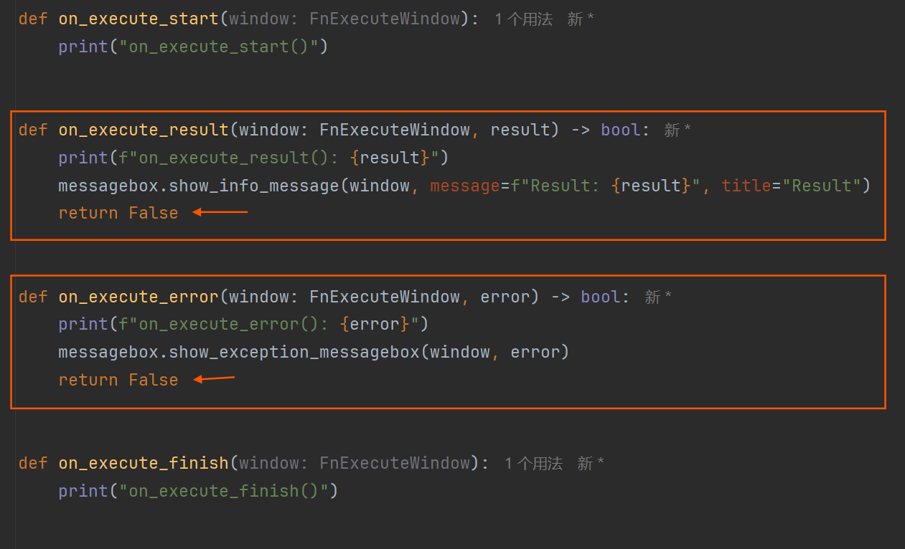
</div>

这表示将由开发者自行处理函数返回结果或函数执行异常，而不会执行默认的处理逻辑，具体而言，`PyGUIAdapter`将不会把函数执行结果或函数异常信息打印到输出浏览器中。

下面是该程序的运行效果：

（1）当函数正常返回时

<div style="text-align: center">
    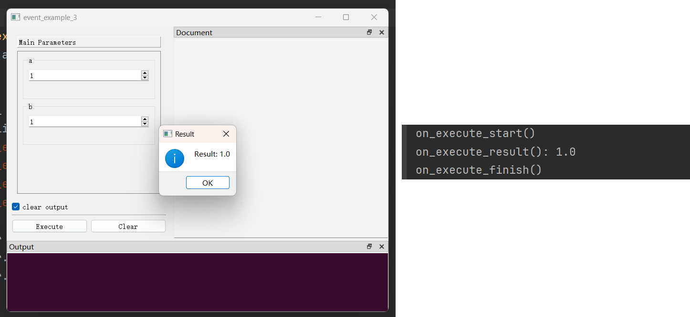
</div>

（2）当函数发生异常时

<div style="text-align: center">
    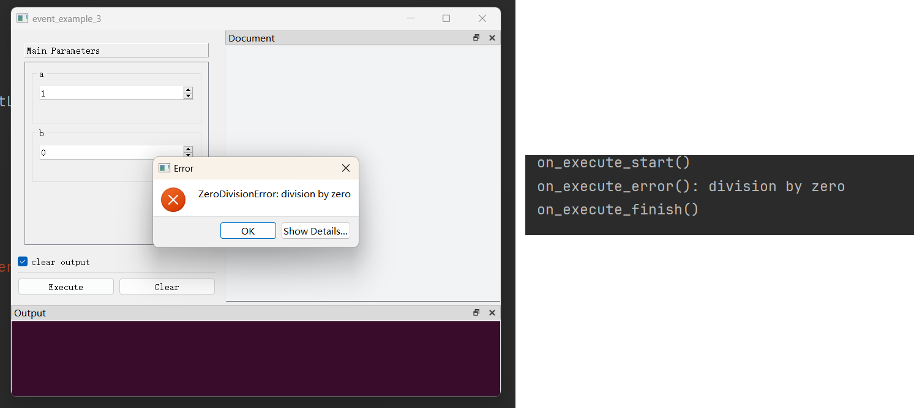
</div>


### 4、添加菜单和工具栏

开发者可以为`FnExecuteWindow`添加工具栏和菜单栏，具体方法如下：

<div style="text-align: center">
    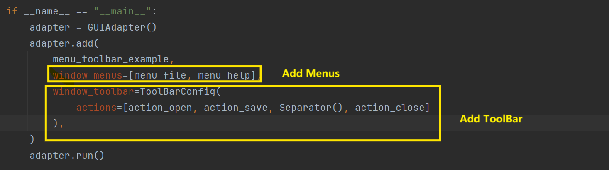
</div>

```python
from pyguiadapter.action import Action, Separator
from pyguiadapter.adapter import GUIAdapter
from pyguiadapter.menu import Menu
from pyguiadapter.toolbar import ToolBar
from pyguiadapter.windows.fnexec import FnExecuteWindow
from pyguiadapter.utils import messagebox, filedialog


def on_action_about(window: FnExecuteWindow, _: Action):
    messagebox.show_info_message(
        parent=window,
        message="This is an example of toolbar and menu with custom actions.",
        title="About",
    )


def on_action_close(window: FnExecuteWindow, _: Action):
    ret = messagebox.show_question_message(
        window, "Are you sure you want to quit?", buttons=messagebox.Yes | messagebox.No
    )
    if ret == messagebox.Yes:
        window.close()


def on_action_open(window: FnExecuteWindow, _: Action):
    ret = filedialog.get_open_file(
        window,
        title="Open File",
        start_dir="./",
        filters="JSON files(*.json);;Python files(*.py);;All files(*.*)",
    )
    if not ret:
        return
    messagebox.show_info_message(window, f"File will be opened: {ret}")


def on_action_save(window: FnExecuteWindow, _: Action):
    ret = filedialog.get_save_file(
        window,
        title="Save File",
        start_dir="./",
        filters="JSON files(*.json);;All files(*.*)",
    )
    if not ret:
        return
    messagebox.show_info_message(window, f"File will be saved: {ret}")


def on_action_auto_theme(window: FnExecuteWindow, _: Action, checked: bool):
    if checked:
        messagebox.show_info_message(window, "Auto theme is selected.")


def on_action_light_theme(window: FnExecuteWindow, _: Action, checked: bool):
    if checked:
        messagebox.show_info_message(window, "Light theme is selected.")


def on_action_dark_theme(window: FnExecuteWindow, _: Action, checked: bool):
    if checked:
        messagebox.show_info_message(window, "Dark theme is selected.")


action_about = Action(
    text="About",
    icon="fa.info-circle",
    on_triggered=on_action_about,
)

action_open = Action(
    text="Open",
    icon="fa.folder-open",
    shortcut="Ctrl+O",
    on_triggered=on_action_open,
)

action_save = Action(
    text="Save",
    icon="fa.save",
    shortcut="Ctrl+S",
    on_triggered=on_action_save,
)

action_close = Action(
    text="Quit",
    icon="fa.close",
    shortcut="Ctrl+Q",
    on_triggered=on_action_close,
)

action_auto_them = Action(
    text="Auto",
    checkable=True,
    checked=True,
    on_toggled=on_action_auto_theme,
)

action_light_theme = Action(
    text="Light",
    checkable=True,
    on_toggled=on_action_light_theme,
)

action_dark_theme = Action(
    text="Dark",
    checkable=True,
    on_toggled=on_action_dark_theme,
)

submenu_theme = Menu(
    title="Theme",
    actions=[action_auto_them, action_light_theme, action_dark_theme],
    exclusive=True,
)
menu_file = Menu(
    title="File",
    actions=[
        action_open,
        action_save,
        Separator(),
        action_close,
        Separator(),
        submenu_theme,
    ],
)
menu_help = Menu(
    title="Help",
    actions=[action_about],
)


def menu_toolbar_example(arg1: int, arg2: str, arg3: bool):
    """
    This example shows how to add and config toolbar and menus to the window.
    @param arg1:
    @param arg2:
    @param arg3:
    @return:
    """
    pass


if __name__ == "__main__":
    adapter = GUIAdapter()
    adapter.add(
        menu_toolbar_example,
        window_menus=[menu_file, menu_help],
        window_toolbar=ToolBar(
            actions=[action_open, action_save, Separator(), action_close]
        ),
    )
    adapter.run()

```

效果如下：

<div style="text-align: center">
    
</div>

### 5、主要接口

`函数执行窗口（FnExecuteWindow）`提供了大量接口，开发者可以在`动作（Action）`回调函数或窗口事件回调函数中调用这些接口。借助这些接口，开发者可以实现相当复杂的功能，比如动态设置/获取参数的当前值，设置是动态增加/删除参数控件。

可以参考以下文档获取这些接口的具体信息：

- [pyguiadapter.windows.fnexec.FnExecuteWindow](apis/pyguiadapter.windows.fnexec.md#pyguiadapter.windows.fnexec.FnExecuteWindow)。

下面，通过一些示例来说明这些接口的使用。

#### （1）示例：加载和保存当前参数

下面结合菜单的使用，实现参数的保存和加载的效果。

```python
import json

from typing import Dict, Any

from pyguiadapter.action import Action
from pyguiadapter.adapter import GUIAdapter
from pyguiadapter.adapter.uoutput import uprint
from pyguiadapter.exceptions import ParameterError
from pyguiadapter.extend_types import color_t
from pyguiadapter.menu import Menu
from pyguiadapter.utils import messagebox, filedialog
from pyguiadapter.windows.fnexec import FnExecuteWindow


def simple_load_save_example(
    arg1: int,
    arg2: float,
    arg3: bool,
    arg4: str,
    arg5: color_t,
):
    """
    This example shows how to save current parameter values to a json file and load a parameter values from a json file.
    @param arg1:
    @param arg2:
    @param arg3:
    @param arg4:
    @param arg5:
    @return:
    """
    uprint("arg1=", arg1)
    uprint("arg2=", arg2)
    uprint("arg3=", arg3)
    uprint("arg4=", arg4)
    uprint("arg5=", arg5)


def on_save_params(window: FnExecuteWindow, _: Action):
    # Step 1: obtain current parameter values from widgets
    #
    # if the current input in the widgets of some parameter is invalid, the get_parameter_values() method may raise a
    # exception. A good practice is to catch the exception and handle it properly:
    #  - for ParameterError, the FnExecuteWindow has a builtin logic to deal with it, so just call the
    #  process_parameter_error() method and let the window do the job.
    #
    #  - for other exceptions, we need handle it by ourselves. Here we choose to show the exception message with a
    #  message box to the user.

    try:
        params: Dict[str, Any] = window.get_parameter_values()
    except ParameterError as e:
        window.process_parameter_error(e)
        return
    except Exception as e:
        messagebox.show_exception_messagebox(
            window, e, message="Unable to get the parameters: "
        )
        return

    # Step2: serialize the parameter values and save them to a json file
    #
    # In this example, because we don't use any complex types, we can use simply json.dump() to do the serialization.
    # However, If your function contains parameters of complex types, such as list, tuple, set, dict, enum, then
    # serialization and deserialization must be considered very carefully.
    #
    save_file = filedialog.get_save_file(
        window, "Save Parameters", filters="JSON files(*.json)"
    )
    if not save_file:
        return
    try:
        with open(save_file, "w") as f:
            json.dump(params, f)
    except Exception as e:
        messagebox.show_exception_messagebox(
            window, e, message="Unable to save the parameters: "
        )
    else:
        messagebox.show_info_message(window, "Parameters have been saved!")


def on_load_params(window: FnExecuteWindow, _: Action):
    # Step 1: load the parameter values from a json file
    file = filedialog.get_open_file(
        window, "Load Parameters", filters="JSON files(*.json)"
    )
    if not file:
        return
    try:
        with open(file, "r") as f:
            params: Dict[str, Any] = json.load(f)
    except Exception as e:
        messagebox.show_exception_messagebox(
            window, e, message="Unable to load the parameters: "
        )
        return
    if not isinstance(params, dict):
        messagebox.show_critical_message(window, message="Invalid parameters format!")
        return

    # Step2: set the parameter values to the widgets
    try:
        window.set_parameter_values(params)
    except ParameterError as e:
        window.process_parameter_error(e)
        return
    except Exception as e:
        messagebox.show_exception_messagebox(
            window, e, message="Unable to set the parameters: "
        )
    else:
        messagebox.show_info_message(window, "Parameters have been loaded!")


if __name__ == "__main__":
    action_save_params = Action(
        text="Save Parameters",
        icon="fa.save",
        shortcut="Ctrl+S",
        on_triggered=on_save_params,
    )

    action_load_params = Action(
        text="Load Parameters",
        icon="fa.folder-open",
        shortcut="Ctrl+L",
        on_triggered=on_load_params,
    )

    menu = Menu(
        title="File",
        actions=[action_save_params, action_load_params],
    )

    adapter = GUIAdapter()
    adapter.add(simple_load_save_example, window_menus=[menu])
    adapter.run()

```

**需要说明的是**，上面演示的只是比较简单的情形，函数只包含一些简单类型的参数，因此可以（几乎）可以直接使用`json`对`get_parameter_values()`获取到的值进行序列化和反序列化。然而，一旦包含更为复杂的类型，例如`dict`、`list`、`tuple`、`set`、`Enum`等，那么就需要认真考虑序列化和反序列化的问题了。当然，方案有很多，如`pickle`、`jsonpickle`等，具体的做法一定是和具体的场景结合起来的，这里无法展开，仅仅是做一个提示。

另外，在以上代码中，有很大一部分是在做异常处理，这一方面这是为了说明异常处理的重要性，另一方面也是为了演示如何运用`utils`包提供的实用函数。

**关于`ParameterError`**：出现这类异常主要是因为从控件获取/设置参数值时遇到了非法的输入。因为这种错误比较常见，所以`FnExecuteWindow`为其内建了一套处理流程，当捕获到此类异常时，如无需进行特别处理，开发者可以直接调用`process_parameter_error()`。

#### （2）示例：调整Dock窗口（隐藏/显示/调整位置......）

```python
from pyguiadapter.action import Action, Separator
from pyguiadapter.adapter import GUIAdapter
from pyguiadapter.menu import Menu
from pyguiadapter.windows.fnexec import (
    FnExecuteWindow,
    BottomDockWidgetArea,
)


def dock_operation_example() -> None:
    pass


def on_toggle_document_dock(win: FnExecuteWindow, action: Action):
    win.set_document_dock_property(visible=not win.is_document_dock_visible())


def on_toggle_output_dock(win: FnExecuteWindow, action: Action):
    win.set_output_dock_property(visible=not win.is_output_dock_visible())


def on_tabify_docks(win: FnExecuteWindow, action: Action):
    win.tabify_docks()


def on_move_output_area(win: FnExecuteWindow, action: Action):
    if win.is_output_dock_floating():
        win.set_output_dock_property(floating=False)
    win.set_output_dock_property(area=BottomDockWidgetArea)


def on_float_output_dock(win: FnExecuteWindow, action: Action):
    win.set_output_dock_property(floating=True)


def main():
    action_document_dock = Action(
        text="Toggle Document Dock",
        on_triggered=on_toggle_document_dock,
    )
    action_output_dock = Action(
        text="Toggle Output Dock",
        on_triggered=on_toggle_output_dock,
    )
    action_tabify_docks = Action(
        text="Tabify Docks",
        on_triggered=on_tabify_docks,
    )
    action_move_output_area = Action(
        text="Move Output Area",
        on_triggered=on_move_output_area,
    )
    action_float_output_dock = Action(
        text="Float Output Dock",
        on_triggered=on_float_output_dock,
    )
    menu_views = Menu(
        title="Views",
        actions=[
            action_document_dock,
            action_output_dock,
            Separator(),
            action_tabify_docks,
            action_move_output_area,
            action_float_output_dock,
        ],
    )
    ##########
    adapter = GUIAdapter()
    adapter.add(dock_operation_example, window_menus=[menu_views])
    adapter.run()


if __name__ == "__main__":
    main()

```

