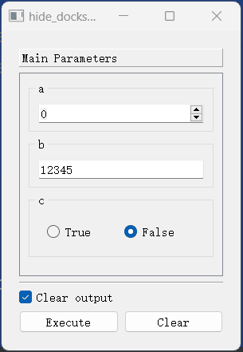

## 函数执行窗口（FnExecuteWindow）

### 一、简介

`函数执行窗口（FnExecuteWindow）`是用户与程序进行交互的主要界面。一个典型的`函数执行窗口（FnExecuteWindow）`由以下几个部分组成：


包括一个固定区域（`Parameters Area`）和两个停靠窗口（`Document Dock`和`Output Dock`）。

1. **参数控件区（Parameters Area）**：主要用于放置函数参数控件。

2. **函数文档停靠窗口（Document Dock）**：主要用于显示函数的文档信息。默认情况下，其内容来源于函数的`文档字符串（docstring）`。

3. **程序输出停靠窗口（Output Dock）**：主要用于显示程序的输出信息。默认情况下，函数的返回值、函数调用过程中发生的异常信息均会显示在此区域。

### 二、配置窗口属性

#### （一）简介

|           配置项名称           |                             类型                             |         默认值          |                             说明                             |
| :----------------------------: | :----------------------------------------------------------: | :---------------------: | :----------------------------------------------------------: |
|            `title`             |                    `Union[str, NoneType]`                    |         `None`          | 窗口标题。默认为`None`，此时将使用函数的显示名称（`display_name`）作为窗口标题（如果开发者未指定`display_name`，则其等同于函数名，关于如何指定`display_name`，可以参考这篇文档：[函的数名称、图标、文档及分组](adapter/multiple_functions.md??id=二、修改函数图标和显示名称)。） |
|             `icon`             | `Union[str, Tuple[str, Union[list, dict]], QIcon, QPixmap, NoneType]` |         `None`          | 窗口图标。如果开发者未指定窗口图标，则将使用添加函数时指定的`icon`。（关于如何在添加函数指定其`icon`，可以参考这篇文档：[函的数名称、图标、文档及分组](adapter/multiple_functions.md??id=二、修改函数图标和显示名称)。） |
|             `size`             |               `Union[Tuple[int, int], QSize]`                |      `(1024, 768)`      |                         窗口的尺寸。                         |
|           `position`           |              `Union[Tuple[int, int], NoneType]`              |         `None`          | 窗口的位置，默认为`None`，即使用系统默认值，一般是居中显示。 |
|        `always_on_top`         |                            `bool`                            |         `False`         |                      窗口是否总是置顶。                      |
|         `font_family`          |            `Union[str, Sequence[str], NoneType]`             |         `None`          |                       窗口的字体家族。                       |
|          `font_size`           |                    `Union[int, NoneType]`                    |         `None`          |                       窗口的字体大小。                       |
|          `stylesheet`          |                    `Union[str, NoneType]`                    |         `None`          |                        窗口的样式表。                        |
|      `output_dock_ratio`       |                           `float`                            |          `0.3`          |                                                              |
|     `document_dock_ratio`      |                           `float`                            |          `0.6`          |                                                              |
|       `show_output_dock`       |                            `bool`                            |         `True`          |                                                              |
|     `output_dock_floating`     |                            `bool`                            |         `False`         |                                                              |
|     `output_dock_position`     |                       `DockWidgetArea`                       |           `8`           |                                                              |
|      `show_document_dock`      |                            `bool`                            |         `True`          |                                                              |
|    `document_dock_floating`    |                            `bool`                            |         `False`         |                                                              |
|    `document_dock_position`    |                       `DockWidgetArea`                       |           `2`           |                                                              |
|         `tabify_docks`         |                            `bool`                            |         `False`         |                                                              |
|         `progressbar`          |             `Union[ProgressBarConfig, NoneType]`             |         `None`          |                                                              |
|        `output_config`         |                    `OutputBrowserConfig`                     |  `OutputBrowserConfig`  |                                                              |
|       `document_config`        |           `Union[DocumentBrowserConfig, NoneType]`           | `DocumentBrowserConfig` |                                                              |
| `default_parameter_group_name` |                            `str`                             |    `Main Parameters`    |                                                              |
| `default_parameter_group_icon` | `Union[str, Tuple[str, Union[list, dict]], QIcon, QPixmap, NoneType]` |         `None`          |                                                              |
|    `parameter_group_icons`     | `Dict[str, Union[str, Tuple[str, Union[list, dict]], QIcon, QPixmap, NoneType]]` |          `{}`           |                                                              |
|      `show_clear_button`       |                            `bool`                            |         `True`          |                                                              |
|      `enable_auto_clear`       |                            `bool`                            |         `True`          |                                                              |
|    `print_function_result`     |                            `bool`                            |         `True`          |                                                              |
|     `show_function_result`     |                            `bool`                            |         `False`         |                                                              |
|     `print_function_error`     |                            `bool`                            |         `True`          |                                                              |
|     `show_function_error`      |                            `bool`                            |         `True`          |                                                              |
|     `show_error_traceback`     |                            `bool`                            |         `True`          |                                                              |
|         `widget_texts`         |                        `WidgetTexts`                         |           ``            |                                                              |
|        `message_texts`         |                        `MessageTexts`                        |                         |                                                              |

#### （二）配置窗口属性的方法


#### （三）一些示例

##### 1、隐藏停靠窗口，改变窗口尺寸

```python
from pyguiadapter.adapter import GUIAdapter, udialog
from pyguiadapter.exceptions import ParameterError
from pyguiadapter.windows.fnexec import FnExecuteWindowConfig


def hide_docks_example(a: int, b: str, c: bool):
    if a < 0:
        raise ParameterError("a", "a must >= 0")
    if b == "":
        raise ValueError("invalid value of b")
    udialog.show_info_messagebox(f"Receive: {a}, {b}, {c}")


if __name__ == "__main__":
    adapter = GUIAdapter()
    adapter.add(
        hide_docks_example,
        window_config=FnExecuteWindowConfig(
            size=(300, 400),
            document_dock_visible=False,
            output_dock_visible=False,
        ),
    )
    adapter.run()

```




### 三、监听窗口事件

### 四、添加工具栏

### 五、添加菜单栏

### 六、主要函数接口

