## 函数执行窗口（FnExecuteWindow）

### 一、简介

`函数执行窗口（FnExecuteWindow）`是用户与程序进行交互的主要界面。一个典型的`函数执行窗口（FnExecuteWindow）`由以下几个部分组成：

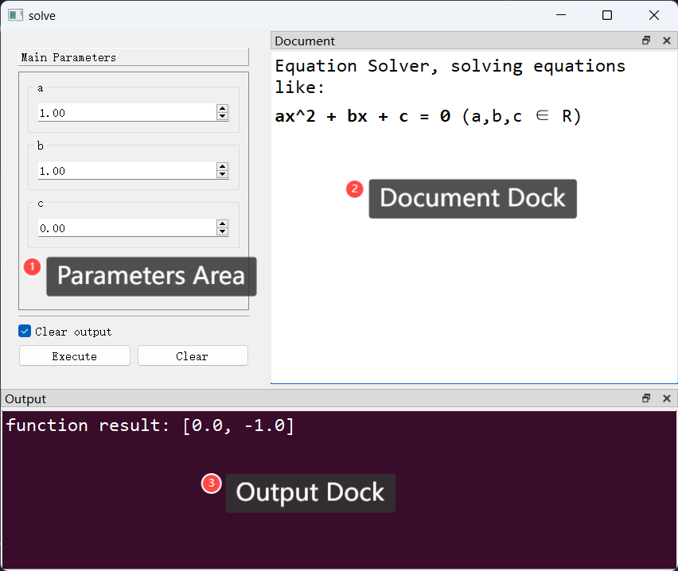

包括一个固定区域（`Parameters Area`）和两个停靠窗口（`Document Dock`和`Output Dock`）。

1. **参数控件区（Parameters Area）**：主要用于放置函数参数控件。

2. **文档停靠窗口（Document Dock）**：主要用于显示函数的文档信息。默认情况下，其内容来源于函数的`文档字符串（docstring）`。

3. **输出停靠窗口（Output Dock）**：主要用于显示程序的输出信息。默认情况下，函数的返回值、函数调用过程中发生的异常信息均会显示在此区域。

### 二、配置窗口属性

#### （一）配置类`FnExecuteWindowConfig`

`函数执行窗口（FnExecuteWindow）`的窗口属性由配置类`FnExecuteWindowConfig`定义，该类定义了`函数执行窗口（FnExecuteWindow）`有以下可配置属性。

> `FnExecuteWindow`与`FnExecuteWindowConfig`均在`pyguiadapter.windows.fnexec`包下，可通过以下方式导入：
>
> ```python
> from pyguiadapter.windows.fnexec import FnExecuteWindowConfig
> from pyguiadapter.windows.fnexec import FnExecuteWindow
> ```


|            配置项名称            |                             类型                             |               默认值                |                             说明                             |
| :------------------------------: | :----------------------------------------------------------: | :---------------------------------: | :----------------------------------------------------------: |
|             `title`              |                    `Union[str, NoneType]`                    |               `None`                | 窗口标题。默认为`None`，此时将使用函数的显示名称（`display_name`）作为窗口标题（如果开发者未指定`display_name`，则其等同于函数名，关于如何指定`display_name`，可以参考这篇文档：[函的数名称、图标、文档及分组](adapter/multiple_functions.md??id=二、修改函数图标和显示名称)。） |
|              `icon`              | `Union[str, Tuple[str, Union[list, dict]], QIcon, QPixmap, NoneType]` |               `None`                | 窗口图标。如果开发者未指定窗口图标，则将使用添加函数时指定的`icon`。（关于如何在添加函数指定其`icon`，可以参考这篇文档：[函的数名称、图标、文档及分组](adapter/multiple_functions.md??id=二、修改函数图标和显示名称)。） |
|              `size`              |               `Union[Tuple[int, int], QSize]`                |            `(1024, 768)`            |                         窗口的尺寸。                         |
|            `position`            |              `Union[Tuple[int, int], NoneType]`              |               `None`                | 窗口的位置，默认为`None`，即使用系统默认值，一般是居中显示。 |
|         `always_on_top`          |                            `bool`                            |               `False`               |                      窗口是否总是置顶。                      |
|          `font_family`           |            `Union[str, Sequence[str], NoneType]`             |               `None`                |                       窗口的字体家族。                       |
|           `font_size`            |                    `Union[int, NoneType]`                    |               `None`                |                       窗口的字体大小。                       |
|           `stylesheet`           |                    `Union[str, NoneType]`                    |               `None`                |                        窗口的样式表。                        |
|      `execute_button_text`       |                            `str`                             |             `"Execute"`             |              执行按钮的文字。默认为"Execute"。               |
|       `cancel_button_text`       |                            `str`                             |             `"Cancel"`              | 取消按钮的文字。默认为"Cancel"。注意，只有当函数被标记为`cancelable`才会出现取消按钮。如何将函数标记为`cancelable`，可以参考这篇文档：[取消正在执行的函数：协商式线程退出机制](adapter/cancellable_function.md) |
|      `clear_button_visible`      |                            `bool`                            |               `True`                |    是否显示清除输出按钮。开发者可以通过此属性隐藏该按钮。    |
|       `clear_button_text`        |                            `str`                             |              `"Clear"`              |                     清除输出按钮的文字。                     |
|     `clear_checkbox_visible`     |                            `bool`                            |               `True`                |                    是否显示清除输出选框。                    |
|     `clear_checkbox_checked`     |                            `bool`                            |               `True`                |          是否将清除输出选框初始状态设置为勾选状态。          |
|       `statusbar_visible`        |                            `bool`                            |               `True`                |                   是否显示窗口底部状态栏。                   |
|      `initial_docks_state`       |                `Literal["auto", "tabified"]`                 |              `"auto"`               | 停靠窗口的初始状态。当设置为`"tabified"`时，所有停靠窗口会显示出标签页的形式。默认为`"auto"`，即分开显示。 |
|      `output_dock_visible`       |                            `bool`                            |               `True`                |                   是否显示`Output Dock`。                    |
|       `output_dock_title`        |                            `str`                             |             `"Output"`              |                    `Output Dock`的标题。                     |
|      `output_dock_floating`      |                            `bool`                            |               `False`               |            是否使`Output Dock`漂浮在主窗体之上。             |
|    `output_dock_initial_area`    |                       `DockWidgetArea`                       |       `BottomDockWidgetArea`        | `Output Dock`的初始停靠位置，默认为`BottomDockWidgetArea`，即停靠在窗体的下部。 |
|    `output_dock_initial_size`    |            `Tuple[Optional[int], Optional[int]]`             |            `(None, 230)`            | `Output Dock`的初始大小，默认为`(None, 230)`，即宽度与主窗口一致，高度为`230`（默认窗口高度的30%）。 |
|     `document_dock_visible`      |                            `bool`                            |               `True`                |                  是否显示`Document Dock`。                   |
|      `document_dock_title`       |                            `str`                             |            `"Document"`             |                   `Document Dock`的标题。                    |
|     `document_dock_floating`     |                            `bool`                            |               `True`                |           是否使`Document Dock`漂浮在主窗体之上。            |
|   `document_dock_initial_area`   |                       `DockWidgetArea`                       |        `RightDockWidgetArea`        | `Document Dock`的初始停靠位置，默认为`RightDockWidgetArea`，即停靠在窗体的下部。 |
|   `document_dock_initial_size`   |            `Tuple[Optional[int], Optional[int]]`             |            `(614, None)`            | `Document Dock`的初始大小，默认为`(614, None)`，即宽度为614（默认窗口宽度的60%），高度与主窗口一致。 |
|     `output_browser_config`      |               `Optional[OutputBrowserConfig]`                |               `None`                |                    程序输出浏览器的配置。                    |
|    `document_browser_config`     |              `Optional[DocumentBrowserConfig]`               |               `None`                |                    函数文档浏览器的配置。                    |
|  `default_parameter_group_name`  |                            `str`                             |         `"Main Parameters"`         |                     默认参数分组的名称。                     |
|  `default_parameter_group_icon`  |                          `IconType`                          |               `None`                |                     默认参数分组的图标。                     |
|     `parameter_group_icons`      |                    `Dict[str, IconType]`                     |                `{}`                 |                   各个参数分组对应的图标。                   |
|     `print_function_result`      |                            `bool`                            |               `True`                |               是否在输出区域打印函数调用结果。               |
|      `show_function_result`      |                            `bool`                            |               `False`               |                  是否弹窗显示函数调用结果。                  |
|      `print_function_error`      |                            `bool`                            |               `True`                |         是否在输出区域打印函数调用过程中的异常信息。         |
|      `show_function_error`       |                            `bool`                            |               `True`                |            是否弹窗显示函数调用过程中的异常信息。            |
|    `function_error_traceback`    |                            `bool`                            |               `True`                |                   是否显示异常的回溯信息。                   |
|       `error_dialog_title`       |                            `str`                             |              `"Error"`              |                   错误（异常）弹窗的标题。                   |
|      `result_dialog_title`       |                            `str`                             |             `"Result"`              |                     函数结果弹窗的标题。                     |
|    `parameter_error_message`     |                            `str`                             |             `"{}: {}"`              | [`pyguiadapter.exceptions.ParameterError`]()类异常的消息模板。模板第一个位置将被替换为发生[`pyguiadapter.exceptions.ParameterError`]()的参数的名称，第二个位置将被替换为该异常的描述消息。 |
|    `function_result_message`     |                            `str`                             |      `"function result: {}\n"`      |                     函数结果的消息模板。                     |
|     `function_error_message`     |                            `str`                             |            `"{}: {}\n"`             | 函数异常的消息模板。第一个位置将被替换为异常类的名称，第二个位置将被替换为异常的消息。 |
|   `function_executing_message`   |                            `str`                             |  `"A function is executing now!"`   | 消息字符串。当用户意图执行一项操作，而该操作又不允许在函数正在执行时进行的情况下，会发出此提示。比如，函数正在进行，用户要关闭窗口。 |
| `uncancelable_function_message`  |                            `str`                             | `"The function is not cancelable!"` | 消息字符串。当函数为”不可取消“的，而用户又发出取消函数信号时，将提示此消息。 |
| `function_not_executing_message` |                            `str`                             |  `"No function is executing now!"`  | 消息字符串。当一项操作又必须在运行时进行，而函数恰好又不在运行状态时，将提示此消息。比如，取消操作必须在函数正在运行时才有效，当函数不在运行时，发出取消信号，将提示此消息。 |

**关于`DocumentBrowserConfig`：** 该类用于配置文档浏览器属性，在[`pyguiadapter.windows.document_browser.DocumentBrowserConfig`]()中定义，可以通过如下方式引入：

```python
from pyguiadapter.windows import DocumentBrowserConfig
```

文档浏览器主要包含以下属性：

|      配置项名称       |            类型             |                默认值                 |                       说明                       |
| :-------------------: | :-------------------------: | :-----------------------------------: | :----------------------------------------------: |
|     `text_color`      |            `str`            |               `#000000`               |              文本颜色。默认为黑色。              |
|     `font_family`     | `Union[Sequence[str], str]` | `('Consolas', 'Arial', 'sans-serif')` |                  文本字体系列。                  |
|      `font_size`      |            `int`            |                 `12`                  |                  文本字体大小。                  |
|  `background_color`   |            `str`            |               `#FFFFFF`               |              背景颜色。默认为白色。              |
|   `line_wrap_mode`    |       `LineWrapMode`        |      `LineWrapMode.WidgetWidth`       |        行包裹模式。默认根据控件宽度换行。        |
|   `line_wrap_width`   |            `int`            |                 `88`                  |                   行包裹宽度。                   |
|   `word_wrap_mode`    |         `WrapMode`          |          `WrapMode.WordWrap`          |                   词包裹模式。                   |
| `open_external_links` |           `bool`            |                `True`                 | 是否可以允许调用系统浏览器打开文档中的外部链接。 |
|     `stylesheet`      |            `str`            |                 `""`                  |                     样式表。                     |

下图时默认状态下文档浏览器的典型外观：

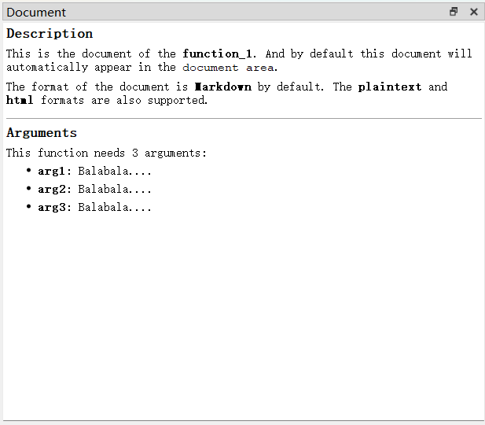

**关于`OutputBrowserConfig`**：该类用于配置输出浏览器的属性，可以通过以下方式导入：

> ```python
> from pyguiadapter.windows.fnexec import OutputBrowserConfig
> ```

输出浏览器主要具有以下属性：

|      配置项名称       |            类型             |                默认值                 |                       说明                       |
| :-------------------: | :-------------------------: | :-----------------------------------: | :----------------------------------------------: |
|     `text_color`      |            `str`            |               `#000000`               |              文本颜色。默认为黑色。              |
|     `font_family`     | `Union[Sequence[str], str]` | `('Consolas', 'Arial', 'sans-serif')` |                  文本字体系列。                  |
|      `font_size`      |            `int`            |                 `12`                  |                  文本字体大小。                  |
|  `background_color`   |            `str`            |               `#FFFFFF`               |              背景颜色。默认为白色。              |
|   `line_wrap_mode`    |       `LineWrapMode`        |      `LineWrapMode.WidgetWidth`       |        行包裹模式。默认根据控件宽度换行。        |
|   `line_wrap_width`   |            `int`            |                 `88`                  |                   行包裹宽度。                   |
|   `word_wrap_mode`    |         `WrapMode`          |          `WrapMode.WordWrap`          |                   词包裹模式。                   |
| `open_external_links` |           `bool`            |                `True`                 | 是否可以允许调用系统浏览器打开文档中的外部链接。 |
|     `stylesheet`      |            `str`            |                 `""`                  |                     样式表。                     |

下图时默认情况下输出浏览器的典型外观：

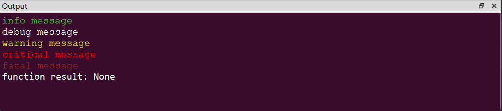

**为什么设置了`DocumentBrowserConfig`和`OutputBrowserConfig`，但有时就是不生效？**

这种情况常见于开发者设置了样式表（qss）或使用了第三方美化库时。第三方美化库对窗口和控件样式的改变基本上都是通过样式表实现的，样式表的优先级要高于`DocumentBrowserConfig`和`OutputBrowserConfig`，因此可能会发生`DocumentBrowserConfig`或`OutputBrowserConfig`设置的样式（如文字颜色、背景色等）被外部样式表覆盖掉，因此看起来像没生效的情况。这可以说是有意为之的一种设计，目的是让文档浏览器和输出浏览器的外观与界面整体风格保持一致。

比如下面这个例子，在设置了`dark`主题后，文档浏览器和输出浏览器的文字颜色、背景颜色等被第三方库调整到合适的状态，如果此时文档浏览器还是默认白底黑字的配色，则会显得有些格格不入。

> [examples/adapter/qdarktheme_example.py]()

```python
"""
This example requires PyQtDarkTheme. Please install it before you run this example.
"""

from datetime import datetime

from pyguiadapter.adapter import GUIAdapter
from pyguiadapter.extend_types import text_t


def app_style_example(
    arg1: str, arg2: int, arg3: float, arg4: bool, arg5: text_t, arg6: datetime
):
    """
    This example requires [PyQtDarkTheme](https://github.com/5yutan5/PyQtDarkTheme).
    Please install it before you run the example.

    <br />

    e.g. using `pip`:

    > `pip install pyqtdarktheme`

    @param arg1: arg1 description
    @param arg2: arg2 description
    @param arg3: arg3 description
    @param arg4: arg4 description
    @param arg5: arg5 description
    @param arg6: arg6 description
    @return:
    """
    ...


if __name__ == "__main__":
    import qdarktheme

    def on_app_start(app):
        # this will be called after the instantiation of QApplication.
        print("app started")
        qdarktheme.setup_theme("dark")

    adapter = GUIAdapter(on_app_start=on_app_start)
    adapter.add(app_style_example)
    adapter.run()

```

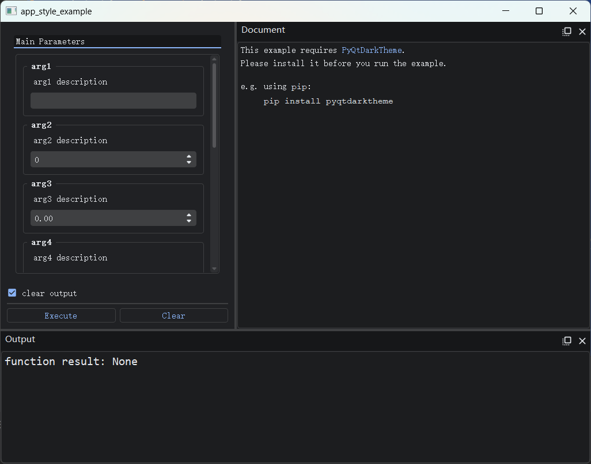

如果开发者确实需要自行设置文档浏览器或输出浏览器的样式，而不希望它被第三方库覆盖，可以通过`DocumentBrowserConfig`或`OutputBrowserConfig`的`stylesheet`属性明确指明所需的样式表，通过`stylesheet`设置的样式一般不会被第三方库覆盖。比如下面的示例，强行将输出浏览器设置为以下样式（其他控件的样式由第三方库决定）：

- 背景色：`#380C2A`
- 文字颜色：`#FFFFFF`
- 字体系列：`Consolas`
- 字体大小：`12pt`

> [examples/windows/style_override_example.py]()

```python
"""
This example requires PyQtDarkTheme. Please install it before you run this example.
"""

from datetime import datetime

from pyguiadapter.adapter import GUIAdapter
from pyguiadapter.extend_types import text_t
from pyguiadapter.windows.fnexec import FnExecuteWindowConfig, OutputBrowserConfig


def app_style_example(
    arg1: str, arg2: int, arg3: float, arg4: bool, arg5: text_t, arg6: datetime
):
    """
    This example requires [PyQtDarkTheme](https://github.com/5yutan5/PyQtDarkTheme).
    Please install it before you run the example.
    <br />

    e.g. using `pip`:

    > `pip install pyqtdarktheme`

    <br />

    The style of output browser will be overridden with **OutputBrowserConfig.stylesheet**

    @param arg1: arg1 description
    @param arg2: arg2 description
    @param arg3: arg3 description
    @param arg4: arg4 description
    @param arg5: arg5 description
    @param arg6: arg6 description
    @return:
    """
    ...


if __name__ == "__main__":
    import qdarktheme

    def on_app_start(app):
        # this will be called after the instantiation of QApplication.
        print("app started")
        qdarktheme.setup_theme("dark")

    adapter = GUIAdapter(on_app_start=on_app_start)
    adapter.add(
        app_style_example,
        window_config=FnExecuteWindowConfig(
            output_browser_config=OutputBrowserConfig(
                stylesheet="""
                background-color: "#380C2A";
                color: "#FFFFFF";
                font-family: "Consolas";
                font-size: 12pt;
                """
            )
        ),
    )
    adapter.run()

```

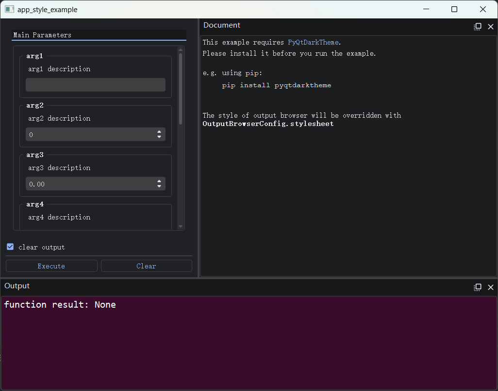

关于如何使用QSS或使用第三方库对窗口进行美化，可以参考以下文档：[界面美化：使用样式表与第三方库](adapter/style.md)

#### （二）配置窗口属性的方法

每个添加到`GUIAdapter`实例的函数都可以配置自己的窗口属性，方法是在调用`GUIAdapter.add()`时通过`window_config`参数传入`FnExecuteWindowConfig`实例。下面的示例中，分别为`function_1`和`function_2`的设置了不同的窗口属性。

> [examples/windows/fn_execute_window_config_example.py]()

```python
from pyguiadapter.adapter import GUIAdapter
from pyguiadapter.windows.fnexec import FnExecuteWindowConfig


def function_1(arg1: int, arg2: str, arg3: bool) -> None:
    ...


def function_2(arg1: int, arg2: str, arg3: bool) -> None:
    ...


if __name__ == "__main__":
    adapter = GUIAdapter()
    adapter.add(
        function_1,
        # set window config for function_1
        window_config=FnExecuteWindowConfig(
            title="Function 1", clear_checkbox_visible=True
        ),
    )
    adapter.add(
        function_2,
        # set window config for function_2
        window_config=FnExecuteWindowConfig(
            title="Function 2",
            clear_checkbox_visible=False,
            clear_checkbox_checked=False,
        ),
    )
    adapter.run()

```

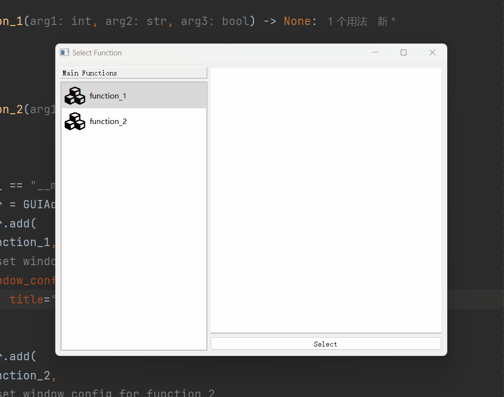


#### （三）一个示例：“小窗口模式”

有时，对于一些小工具，可能并不需要那么复杂的窗口界面，甚至不用显示程序输出区域，仅仅通过弹窗的方式和用户交互即可。通过配置窗口属性，可以实现所谓“小窗口模式”。以下示例进行了如下配置：

- 隐藏了停靠窗口
- 隐藏了清除输出按钮和清除输出选框
- 改变了窗口尺寸
- 改变了窗口标题
- 改变了窗口图标
- 改变了默认参数分组的名称
- 关闭了`print_function_result`、`print_function_error`
- 启用了`show_function_result`
- 修改了`function_result_message`
- 修改了执行按钮的文字
- ......


> [examples/windows/tiny_window_example.py]()

```python
from typing import Optional

from pyguiadapter.adapter import GUIAdapter
from pyguiadapter.exceptions import ParameterError
from pyguiadapter.windows.fnexec import FnExecuteWindowConfig


def equation_solver(a: float, b: float, c: float) -> Optional[tuple]:
    """
    Solving Equations: ax^2 + bx + c = 0 (a,b,c ∈ R, a ≠ 0)
    @param a: a ∈ R, a ≠ 0
    @param b: b ∈ R
    @param c: c ∈ R
    @return:
    """
    if a == 0:
        raise ParameterError(parameter_name="a", message="a cannot be zero!")

    delta = b**2 - 4 * a * c
    if delta < 0:
        return None
    x1 = (-b + delta**0.5) / (2 * a)
    if delta == 0:
        return x1, x1
    x2 = (-b - delta**0.5) / (2 * a)
    return x1, x2


if __name__ == "__main__":
    window_config = FnExecuteWindowConfig(
        title="Equation Solver",
        icon="mdi6.function-variant",
        execute_button_text="Solve",
        size=(350, 450),
        document_dock_visible=False,
        output_dock_visible=False,
        clear_button_visible=False,
        clear_checkbox_visible=False,
        show_function_result=True,
        function_result_message="real roots: {}",
        default_parameter_group_name="Equation Parameters",
        print_function_error=False,
        print_function_result=False,
    )
    adapter = GUIAdapter()
    adapter.add(equation_solver, window_config=window_config)
    adapter.run()

```


### 三、监听窗口事件

开发者可以对`FnExecuteWindow`的事件进行监听并做出响应，比如在关闭窗口前向用户再次进行确认。具体方法如下：

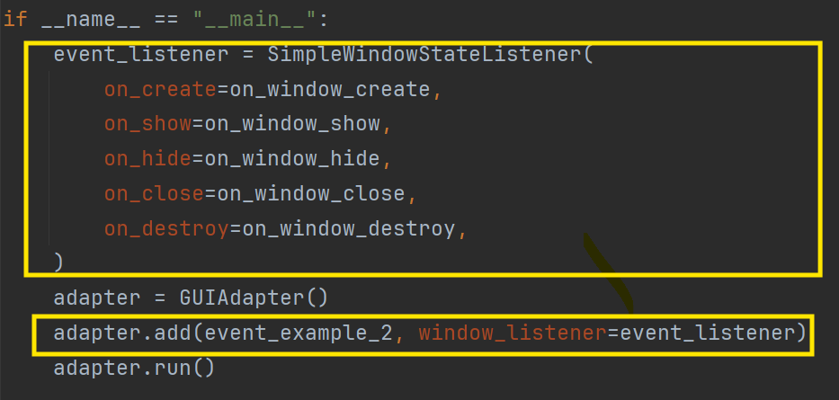

下面是一个简单但完整的例子：

> [examples/windows/window_event_example_2.py]()

```python
from pyguiadapter.adapter import GUIAdapter
from pyguiadapter.window import SimpleWindowEventListener
from pyguiadapter.windows.fnexec import FnExecuteWindow
from pyguiadapter.utils import messagebox


def on_window_create(window: FnExecuteWindow):
    print("on_create")


def on_window_show(window: FnExecuteWindow):
    print("on_show")


def on_window_hide(window: FnExecuteWindow):
    print("on_hide")


def on_window_close(window: FnExecuteWindow) -> bool:
    print("on_close")
    ret = messagebox.show_question_message(
        window,
        title="Confirm Quit",
        message="Are you sure to quit?",
        buttons=messagebox.Yes | messagebox.No,
    )
    if ret == messagebox.Yes:
        return True
    return False


def on_window_destroy(window: FnExecuteWindow):
    print("on_destroy")


def event_example_2():
    ...


if __name__ == "__main__":
    event_listener = SimpleWindowEventListener(
        on_create=on_window_create,
        on_show=on_window_show,
        on_hide=on_window_hide,
        on_close=on_window_close,
        on_destroy=on_window_destroy,
    )
    adapter = GUIAdapter()
    adapter.add(event_example_2, window_listener=event_listener)
    adapter.run()
```

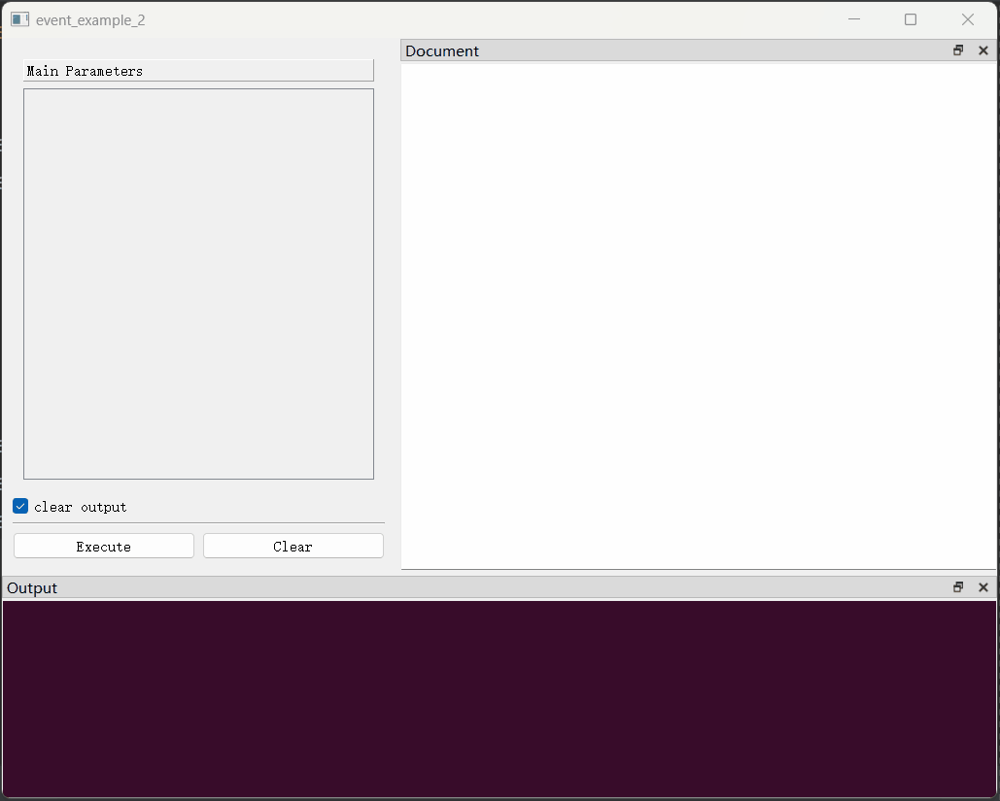


控制台输出如下：

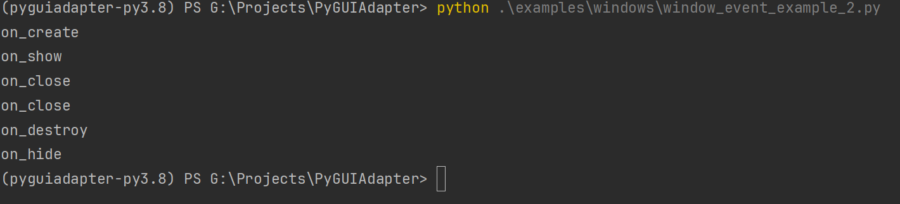

> 关于窗口事件监听，这篇文档作了更为详细的说明：[监听窗口事件](windows/window_event.md)

### 四、添加工具栏和菜单栏

开发者可以为`FnExecuteWindow`添加工具栏和菜单栏。具体方法如下：

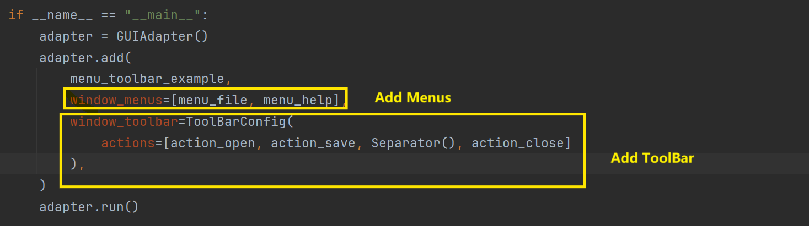

```python
from qtpy.QtWidgets import QAction

from pyguiadapter.action import ActionConfig, Separator
from pyguiadapter.adapter import GUIAdapter
from pyguiadapter.menu import MenuConfig
from pyguiadapter.toolbar import ToolBarConfig
from pyguiadapter.windows.fnexec import FnExecuteWindow
from pyguiadapter.utils import messagebox, filedialog


def on_action_about(window: FnExecuteWindow, action: QAction):
    messagebox.show_info_message(
        parent=window,
        message="This is an example of toolbar and menu with custom actions.",
        title="About",
    )


def on_action_close(window: FnExecuteWindow, action: QAction):
    ret = messagebox.show_question_message(
        window, "Are you sure you want to quit?", buttons=messagebox.Yes | messagebox.No
    )
    if ret == messagebox.Yes:
        window.close()


def on_action_open(window: FnExecuteWindow, action: QAction):
    ret = filedialog.get_open_file(
        window,
        title="Open File",
        start_dir="./",
        filters="JSON files(*.json);;Python files(*.py);;All files(*.*)",
    )
    if not ret:
        return
    messagebox.show_info_message(window, f"File will be opened: {ret}")


def on_action_save(window: FnExecuteWindow, action: QAction):
    ret = filedialog.get_save_file(
        window,
        title="Save File",
        start_dir="./",
        filters="JSON files(*.json);;All files(*.*)",
    )
    if not ret:
        return
    messagebox.show_info_message(window, f"File will be saved: {ret}")


def on_action_auto_theme(window: FnExecuteWindow, action: QAction):
    if action.isChecked():
        messagebox.show_info_message(window, "Auto theme is selected.")


def on_action_light_theme(window: FnExecuteWindow, action: QAction):
    if action.isChecked():
        messagebox.show_info_message(window, "Light theme is selected.")


def on_action_dark_theme(window: FnExecuteWindow, action: QAction):
    if action.isChecked():
        messagebox.show_info_message(window, "Dark theme is selected.")


action_about = ActionConfig(
    text="About",
    icon="fa.info-circle",
    on_triggered=on_action_about,
)

action_open = ActionConfig(
    text="Open",
    icon="fa.folder-open",
    shortcut="Ctrl+O",
    on_triggered=on_action_open,
)

action_save = ActionConfig(
    text="Save",
    icon="fa.save",
    shortcut="Ctrl+S",
    on_triggered=on_action_save,
)

action_close = ActionConfig(
    text="Quit",
    icon="fa.close",
    shortcut="Ctrl+Q",
    on_triggered=on_action_close,
)

action_auto_them = ActionConfig(
    text="Auto",
    checkable=True,
    checked=True,
    on_toggled=on_action_auto_theme,
)

action_light_theme = ActionConfig(
    text="Light",
    checkable=True,
    on_toggled=on_action_light_theme,
)

action_dark_theme = ActionConfig(
    text="Dark",
    checkable=True,
    on_toggled=on_action_dark_theme,
)

submenu_theme = MenuConfig(
    title="Theme",
    actions=[action_auto_them, action_light_theme, action_dark_theme],
    exclusive=True,
)
menu_file = MenuConfig(
    title="File",
    actions=[
        action_open,
        action_save,
        Separator(),
        action_close,
        Separator(),
        submenu_theme,
    ],
)
menu_help = MenuConfig(
    title="Help",
    actions=[action_about],
)


def menu_toolbar_example(arg1: int, arg2: str, arg3: bool):
    """
    This example shows how to add and config toolbar and menus to the window.
    @param arg1:
    @param arg2:
    @param arg3:
    @return:
    """
    ...


if __name__ == "__main__":
    adapter = GUIAdapter()
    adapter.add(
        menu_toolbar_example,
        window_menus=[menu_file, menu_help],
        window_toolbar=ToolBarConfig(
            actions=[action_open, action_save, Separator(), action_close]
        ),
    )
    adapter.run()

```


关于工具栏与菜单栏，以下文档进行了更为详细的说明：

- [为窗口添加工具栏](windows/toolbar.md)
- [为窗口添加菜单栏](windows/menus.md)

### 五、主要函数接口

`FnExecuteWindow`中定义了以下函数接口，由于在`动作（Action）`回调函数或窗口事件回调函数中，开发者可以获取到当前的`FnExecuteWindow`示例，因此开发者可以在这些回调函数中使用以下接口来实现一些特殊的操作，比如：读取当前控件上的参数，将其保存到外部文件中；或者反过来，将外部文件保存的参数设置到对应的控件上。

> 由于`FnExecuteWindow`继承自`BaseWindow`，因此`FnExecuteWindow`中包含了从`BaseWindow`继承而来的函数，具体可以参考：[窗口概述](windows/overview.md)

#### 1、append_output()

```python
FnExecuteWindow.append_output(self, text: str, html: bool = False, scroll_to_bottom: bool = True)
```

该函数用于向输出浏览器中追加内容，是`uprint()`函数最终就是调用这个函数来实现信息打印。

---

#### 2、clear_output()

```python
FnExecuteWindow.clear_output(self)
```

该函数用于清除输出浏览器当前内容。

---

#### 3、set_document()

```python
FnExecuteWindow.set_document(self, document: str, document_format: Literal["markdown", "html", "plaintext"])
```

该函数用于设置文档浏览器显示的文档。

---

#### 4、get_parameter_value()

```python
FnExecuteWindow.get_parameter_value(self, parameter_name: str) -> Any
```

该函数用于获取参数当前值（即当前参数控件上的值）。

**参数：**

- `parameter_name`: 要获取的值的参数的名称

返回值：返回对应参数的当前值。

**异常：**

- 当参数`parameter_name`不存在时，将引发[`pyguiadapter.exceptions.ParameterNotFoundError`]()异常；
- 如果因非法用户输入而导致从控件获取值失败，将引发[`pyguiadapter.exceptions.ParameterError`]()异常；
- 如果因其他原因导致获取值失败也可能会引发异常，此时可以根据具体情况进行捕获。

---

#### 5、get_parameter_values()

```python
FnExecuteWindow.get_parameter_values(self) -> Dict[str, Any]
```

该函数用于获取所有参数的当前值。

**返回值**：

- 函数调用成功后将返回一个字典，该字典的键为参数名称，值为参数当前值

**异常**：

- 如果因存在非法用户输入而导致从控件获取值失败，将引发[`pyguiadapter.exceptions.ParameterError`]()异常；
- 如果因其他原因导致获取值失败，也可能引发异常，此时可以根据具体情况进行捕获，或使用`Exception`进行统一捕获。

---

#### 6、get_parameter_values_of()

```python
FnExecuteWindow.get_parameter_values_of(self, group_name: Optional[str]) -> Dict[str, Any]
```

该函数用于获取指定参数分组下所有参数的当前值。

**参数**：

- `group_name`：要获取当前值的参数分组的名称

---

#### 7、get_parameter_names()

```python
FnExecuteWindow.get_parameter_names(self) -> List[str]
```

该函数用于获取当前所有参数的名称。

---

#### 8、get_parameter_names_of()

```python
FnExecuteWindow.get_parameter_names_of(self, group_name: str) -> List[str]
```

该函数用于获取指定参数分组下所有参数的名称。

**参数**：

- `group_name`：参数分组名称

**异常**：

- 当参数分组不存在时，将引发[`pyguiadapter.exceptions.ParameterNotFoundError`]()异常；

---

#### 9、set_parameter_value()

```python
FnExecuteWindow.set_parameter_value(self, parameter_name: str, value: Any)
```

该函数用于为指定参数设置当前值（即控件上正在显示的值）。

**参数**：

- `parameter_name`：要设置当前值的参数的名称
- `value`：要设置的值

**异常**：

- 当函数参数不存在时，将引发[`pyguiadapter.exceptions.ParameterNotFoundError`]()异常；
- 当传入的`value`为非法值（比如：类型不符合要求或为无效值）时，将引发[`pyguiadapter.exceptions.ParameterError`]()异常；
- 其他原因导致设置参数的值失败，也可能引发异常，此时可以根据具体情况进行捕获，或使用`Exception`进行统一捕获。

---

#### 10、set_parameter_values()

```python
FnExecuteWindow.set_parameter_values(self, values: Dict[str, Any])
```

此函数用于为批量设置参数当前值。未知参数将被忽略，不会抛出[`pyguiadapter.exceptions.ParameterError`]()异常。

**参数**：

- `values`：一个字典，键为要设置值的参数的名称，值为要设置的值。

**异常**：

- 当`values`中存在非法值（比如：类型不符合要求或为无效值）时，将引发[`pyguiadapter.exceptions.ParameterError`]()异常；
- 其他原因导致设置参数的值失败，也可能引发异常，此时可以根据具体情况进行捕获，或使用`Exception`进行统一捕获。

---

#### 11、set_document_dock_property()

```python
FnExecuteWindow.set_output_dock_property(
        self,
        *,
        title: Optional[str] = None,
        visible: Optional[bool] = None,
        floating: Optional[bool] = None,
        area: Optional[DockWidgetArea] = None,
)
```

该函数用于设置文档停靠窗口的各个属性。

**参数**：

- `title`：设置停靠窗口的标题。此参数为可选参数。
- `visible`：设置停靠窗口是否可见。此参数为可选参数。
- `floating`：设置停靠窗口是否漂浮在主窗口之外。此参数为可选参数。
- `area`：设置停靠窗口悬浮的区域。

> `DockWidgetArea`有以下常用值：
>
> - `TopDockWidgetArea`，代表停靠在窗口顶部。
> - `BottomDockWidgetArea`，代表停靠在窗口底部。
> - `LeftDockWidgetArea`，代表停靠在窗口左侧。
> - `RightDockWidgetArea`，代表停靠在窗口右侧。
> - `NoDockWidgetArea`，代表未停靠在窗口状态，比如漂浮状态。
>
> 上述值均可以从[`pyguiadapter.windows.fnexec`]()包导入，比如：
>
> ```python
> from pyguiadapter.windows.fnexec import (
>     TopDockWidgetArea,
>     BottomDockWidgetArea,
>     LeftDockWidgetArea,
>     RightDockWidgetArea,
>     NoDockWidgetArea,
> )
> ```

---

#### 12、is_document_dock_floating()

```python
FnExecuteWindow.is_document_dock_visible(self) -> bool
```

该函数用于检测文档停靠窗口是否处于漂浮状态。

---

#### 13、is_document_dock_visible()

```python
FnExecuteWindow.is_document_dock_visible(self) -> bool
```

该函数用于检测文档停靠窗口是否处于可见状态。

---

#### 14、get_document_dock_title()

```python
FnExecuteWindow.get_document_dock_title(self) -> str
```

该函数用于获取文档停靠窗口当前标题。

---

#### 15、get_document_dock_area()

```python
FnExecuteWindow.get_document_dock_area(self) -> DockWidgetArea
```

该函数用于获取文档停靠窗口当前停靠的区域。

> `DockWidgetArea`有以下常用值：
>
> - `TopDockWidgetArea`，代表停靠在窗口顶部。
> - `BottomDockWidgetArea`，代表停靠在窗口底部。
> - `LeftDockWidgetArea`，代表停靠在窗口左侧。
> - `RightDockWidgetArea`，代表停靠在窗口右侧。
> - `NoDockWidgetArea`，代表未停靠在窗口状态，比如漂浮状态。
>
> 上述值均可以从[`pyguiadapter.windows.fnexec`]()包导入，比如：
>
> ```python
> from pyguiadapter.windows.fnexec import (
>     TopDockWidgetArea,
>     BottomDockWidgetArea,
>     LeftDockWidgetArea,
>     RightDockWidgetArea,
>     NoDockWidgetArea,
> )
> ```

---

#### 16、set_output_dock_property()

```python
FnExecuteWindow.set_output_dock_property(
        self,
        *,
        title: Optional[str] = None,
        visible: Optional[bool] = None,
        floating: Optional[bool] = None,
        area: Optional[DockWidgetArea] = None,
)
```

该函数用于设置输出停靠窗口的各个属性。

**参数**：

- `title`：设置停靠窗口的标题。此参数为可选参数。
- `visible`：设置停靠窗口是否可见。此参数为可选参数。
- `floating`：设置停靠窗口是否漂浮在主窗口之外。此参数为可选参数。
- `area`：设置停靠窗口悬浮的区域。

> `DockWidgetArea`有以下常用值：
>
> - `TopDockWidgetArea`，代表停靠在窗口顶部。
> - `BottomDockWidgetArea`，代表停靠在窗口底部。
> - `LeftDockWidgetArea`，代表停靠在窗口左侧。
> - `RightDockWidgetArea`，代表停靠在窗口右侧。
> - `NoDockWidgetArea`，代表未停靠在窗口状态，比如漂浮状态。
>
> 上述值均可以从[`pyguiadapter.windows.fnexec`]()包导入，比如：
>
> ```python
> from pyguiadapter.windows.fnexec import (
>     TopDockWidgetArea,
>     BottomDockWidgetArea,
>     LeftDockWidgetArea,
>     RightDockWidgetArea,
>     NoDockWidgetArea,
> )
> ```

---

#### 17、is_output_dock_floating()

```python
FnExecuteWindow.is_output_dock_floating(self) -> bool
```

该函数用于检测输出停靠窗口是否处于漂浮状态。

---

#### 18、is_output_dock_visible()

```python
FnExecuteWindow.is_output_dock_visible(self) -> bool
```

该函数用于检测输出停靠窗口是否处于可见状态。

---

#### 19、get_output_dock_title()

```python
FnExecuteWindow.get_output_dock_title(self) -> str
```

该函数用于获取输出停靠窗口当前标题。

---

#### 20、get_output_dock_area()


```python
FnExecuteWindow.get_output_dock_area(self) -> DockWidgetArea
```

该函数用于获取输出停靠窗口当前停靠的区域。

> `DockWidgetArea`有以下常用值：
>
> - `TopDockWidgetArea`，代表停靠在窗口顶部。
> - `BottomDockWidgetArea`，代表停靠在窗口底部。
> - `LeftDockWidgetArea`，代表停靠在窗口左侧。
> - `RightDockWidgetArea`，代表停靠在窗口右侧。
> - `NoDockWidgetArea`，代表未停靠在窗口状态，比如漂浮状态。
>
> 上述值均可以从[`pyguiadapter.windows.fnexec`]()包导入，比如：
>
> ```python
> from pyguiadapter.windows.fnexec import (
>     TopDockWidgetArea,
>     BottomDockWidgetArea,
>     LeftDockWidgetArea,
>     RightDockWidgetArea,
>     NoDockWidgetArea,
> )
> ```

---

#### 21、resize_document_dock()

```python
FnExecuteWindow.resize_document_dock(self, size: Tuple[Optional[int], Optional[int]])
```

该参数调整文档停靠窗口的尺寸。

**参数**：

- `size `：停靠窗口尺寸。为一个二元素元组，形式为(`width`, `height`)，`width`和`height`可为`None`，为`None`表示不设置该维度。

> 停靠窗口的尺寸受到多种因素的影响，无法保证实际的尺寸与开发者设置的尺寸保持一致，尤其时多个停靠窗口停靠在同一区域时。具体而言：
>
> -  尺寸的调整受最小和最大尺寸的约束；
> -  尺寸调整不会影响主窗口的大小；
> -  在空间有限的情况下，将根据各个停靠窗口的相对大小占比进行可以利用空间的调整。

---

#### 22、resize_output_dock()

```python
FnExecuteWindow.resize_output_dock(self, size: Tuple[Optional[int], Optional[int]])
```

该参数用于调整输出停靠窗口的尺寸。

**参数**：

- `size `：停靠窗口尺寸。为一个二元素元组，形式为(`width`, `height`)，`width`和`height`可为`None`，为`None`表示不设置该维度。

> 停靠窗口的尺寸受到多种因素的影响，无法保证实际的尺寸与开发者设置的尺寸保持一致，尤其时多个停靠窗口停靠在同一区域时。具体而言：
>
> -  尺寸的调整受最小和最大尺寸的约束；
> -  尺寸调整不会影响主窗口的大小；
> -  在空间有限的情况下，将根据各个停靠窗口的相对大小占比进行可以利用空间的调整。

---

#### 23、tabify_docks()

```python
FnExecuteWindow.tabify_docks(self)
```

该函数用于将所有停靠窗口放置在同一个停靠区域，并将停靠窗口显示成选项卡的形式。

---

#### 24、set_statusbar_visible()

```python
FnExecuteWindow.set_statusbar_visible(self, visible: bool)
```

该函数用于设置窗口底部状态栏是否可见。

**参数**：

- `visible`：状态栏的可见性。传入`False`将隐藏状态栏。

---

#### 25、is_statusbar_visible()

```python
FnExecuteWindow.is_statusbar_visible(self) -> bool
```

该函数用于判断窗口底部状态栏是否可见。

---

#### 26、show_statusbar_message()

```python
FnExecuteWindow.show_statusbar_message(self, message: str, timeout: int = 3000)
```

该函数用于显示状态栏消息。

**参数**：

- `message`：要显示的消息。
- `timeout`：消息存续的时长，以毫秒计，默认为`3000`毫秒（3秒）。若传入`0`，则该消息将一直显示，直到显示新的消息或调用`clearMessage()`清除了消息。

---

#### 27、clear_statusbar_message()

```python
FnExecuteWindow.show_statusbar_message(self)
```

该函数用于清除当前状态栏消息。

---

#### 28、set_execute_button_text()

```python
FnExecuteWindow.set_execute_button_text(self, text: str)
```

该函数用于设置执行按钮的文本。

**参数**：

- `text`：标题文本。

---


#### 29、set_cancel_button_text()

```python
FnExecuteWindow.set_cancel_button_text(self, text: str)
```

该函数用于设置取消按钮的文本。

**参数**：

- `text`：标题文本。

---

#### 30、set_clear_button_text()

```python
FnExecuteWindow.set_clear_button_text(self, text: str)
```

该函数用于设置清除按钮的文本。

**参数**：

- `text`：标题文本。

---

#### 31、set_clear_checkbox_text()

```python
FnExecuteWindow.set_clear_checkbox_text(self, text: str)
```

该函数用于设置清除选项框的文本。

**参数**：

- `text`：选项框文本。

---

#### 32、set_clear_button_visible()

```python
FnExecuteWindow.set_clear_button_visible(self, visible: bool)
```

该函数用于设置清除按钮是否可见

**参数**：

- `visiable`：按钮的可见性。传入`False`将使按钮隐藏。

---

#### 33、set_clear_checkbox_visible()

```python
FnExecuteWindow.set_clear_checkbox_visible(self, visible: bool)
```

该函数用于设置清除选项框是否可见

**参数**：
- `visiable`：选项框的可见性。传入`False`将使选项框隐藏。

---

#### 34、set_clear_checkbox_checked()

```python
FnExecuteWindow.set_clear_checkbox_checked(self, checked: bool)
```

该函数用于设置清除选项框的选中状态。

**参数**：

- `checked`：选项框的选中状态。

---

#### 35、is_clear_checkbox_checked()

```python
FnExecuteWindow.is_clear_checkbox_checked(self) -> bool
```

该函数用于检测选项框是否处于选中状态。

---

#### 36、is_function_executing()

```python
FnExecuteWindow.is_function_executing(self) -> bool
```

该函数用于获取函数是否正在执行。

----

#### 37、is_function_cancelable()

```python
FnExecuteWindow.is_function_cancelable(self) -> bool
```

该函数用于获取函数是否为可取消函数。

---

#### 38、process_parameter_error()

```python
FnExecuteWindow.process_parameter_error(self, e: ParameterError)
```

该函数用于处理`ParameterError`异常。`FnExecuteWindow`内建了`ParameterError`异常的处理逻辑，开发者捕获到此类异常后，可以直接调用该方法将异常交由窗口处理。

**参数**：

- `e`：捕获到的`ParameterError`。

#### 39、get_document_dock_size()

```python
FnExecuteWindow.get_document_dock_size(self) -> Tuple[int, int]
```

该函数用于获取文档停靠窗口的尺寸。

#### 40、get_output_dock_size()

```python
FnExecuteWindow.get_output_dock_size(self) -> Tuple[int, int]
```

该函数用于获取输出停靠窗口的尺寸。

### 六、一些例子

`FnExecuteWindow`提供的函数接口一般与窗口事件、工具栏、菜单栏等机制结合使用。因为在窗口事件或`动作（Action）`的回调函数中，开发者才有机会访问当前`FnExecuteWindow`实例。下面是一些例子，旨在说明开发者如何使用这些机制以及它们能做些什么。

#### （一）保存和加载当前参数

下面结合菜单的使用，来实现参数的保存和加载的效果。将界面上的当前参数值保存到外部文件，以及从外部文件中读取参数值并使用其设置界面控件，有时是一个比较有用的功能，比如这样可以让使用者方便地分享参数，也可以让使用者将节省调试参数的时间。

要实现这个功能，主要要用到以下几个接口：

- `get_parameter_values()`
- `set_parameter_values()`
- `process_parameter_error`

同时，由于要与用户进行交互，还需要用到`utils`下几个包，主要是：

- `utils.messagebox`
- `utils.filedialog`


具体的代码如下：

> [examples/windows/simple_load_save_example.py]()

```python
import json

from typing import Dict, Any

from qtpy.QtWidgets import QAction

from pyguiadapter.action import ActionConfig
from pyguiadapter.adapter import GUIAdapter
from pyguiadapter.adapter.ucontext import uprint
from pyguiadapter.exceptions import ParameterError
from pyguiadapter.extend_types import color_t
from pyguiadapter.menu import MenuConfig
from pyguiadapter.utils import messagebox, filedialog
from pyguiadapter.windows.fnexec import FnExecuteWindow


def simple_load_save_example(
    arg1: int,
    arg2: float,
    arg3: bool,
    arg4: str,
    arg5: color_t,
):
    """
    This example shows how to save current parameter values to a json file and load a parameter values from a json file.
    @param arg1:
    @param arg2:
    @param arg3:
    @param arg4:
    @param arg5:
    @return:
    """
    uprint("arg1=", arg1)
    uprint("arg2=", arg2)
    uprint("arg3=", arg3)
    uprint("arg4=", arg4)
    uprint("arg5=", arg5)


def on_save_params(window: FnExecuteWindow, action: QAction):
    # Step 1: obtain current parameter values from widgets
    #
    # if the current input in the widgets of some parameter is invalid, the get_parameter_values() method may raise a
    # exception. A good practice is to catch the exception and handle it properly:
    #  - for ParameterError, the FnExecuteWindow has a builtin logic to deal with it, so just call the
    #  process_parameter_error() method and let the window do the job.
    #
    #  - for other exceptions, we need handle it by ourselves. Here we choose to show the exception message with a
    #  message box to the user.

    try:
        params: Dict[str, Any] = window.get_parameter_values()
    except ParameterError as e:
        window.process_parameter_error(e)
        return
    except Exception as e:
        messagebox.show_exception_messagebox(
            window, e, message="Unable to get the parameters: "
        )
        return

    # Step2: serialize the parameter values and save them to a json file
    #
    # In this example, because we don't use any complex types, we can use simply json.dump() to do the serialization.
    # However, If your function contains parameters of complex types, such as list, tuple, set, dict, enum, then
    # serialization and deserialization must be considered very carefully.
    #
    save_file = filedialog.get_save_file(
        window, "Save Parameters", filters="JSON files(*.json)"
    )
    if not save_file:
        return
    try:
        with open(save_file, "w") as f:
            json.dump(params, f)
    except Exception as e:
        messagebox.show_exception_messagebox(
            window, e, message="Unable to save the parameters: "
        )
    else:
        messagebox.show_info_message(window, "Parameters have been saved!")


def on_load_params(window: FnExecuteWindow, action: QAction):
    # Step 1: load the parameter values from a json file
    file = filedialog.get_open_file(
        window, "Load Parameters", filters="JSON files(*.json)"
    )
    if not file:
        return
    try:
        with open(file, "r") as f:
            params: Dict[str, Any] = json.load(f)
    except Exception as e:
        messagebox.show_exception_messagebox(
            window, e, message="Unable to load the parameters: "
        )
        return
    if not isinstance(params, dict):
        messagebox.show_critical_message(window, message="Invalid parameters format!")
        return

    # Step2: set the parameter values to the widgets
    try:
        window.set_parameter_values(params)
    except ParameterError as e:
        window.process_parameter_error(e)
        return
    except Exception as e:
        messagebox.show_exception_messagebox(
            window, e, message="Unable to set the parameters: "
        )
    else:
        messagebox.show_info_message(window, "Parameters have been loaded!")


if __name__ == "__main__":
    action_save_params = ActionConfig(
        text="Save Parameters",
        icon="fa.save",
        shortcut="Ctrl+S",
        on_triggered=on_save_params,
    )

    action_load_params = ActionConfig(
        text="Load Parameters",
        icon="fa.folder-open",
        shortcut="Ctrl+L",
        on_triggered=on_load_params,
    )

    menu = MenuConfig(
        title="File",
        actions=[action_save_params, action_load_params],
    )

    adapter = GUIAdapter()
    adapter.add(simple_load_save_example, window_menus=[menu])
    adapter.run()

```

效果如下：

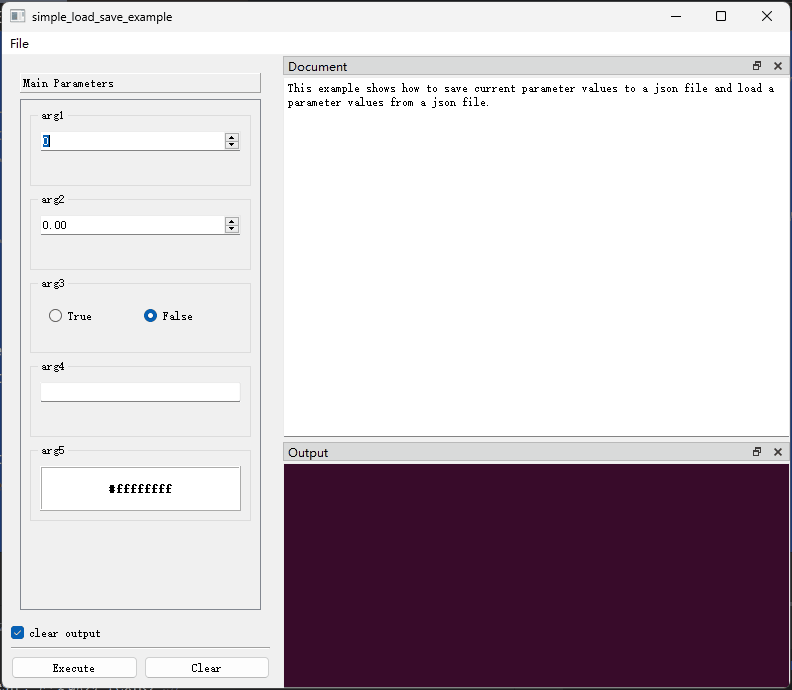

**需要说明的是**，上面演示的只是比较简单的情形，函数只包含一些简单类型的参数，因此可以（几乎）可以直接使用`json`对`get_parameter_values()`获取到的值进行序列化和反序列化。然而，一旦函数的参数包含更为复杂的类型，例如`dict`、`list`、`tuple`、`set`、`Enum`等，那么开发者就需要认真考虑序列化的问题了，当然方案有很多，包括`pickle`、`jsonpickle`等等，具体的做法一定是和具体的场景结合起来的，这里就没办法展开了，仅仅是做一个提示。

另外，在以上示例代码中，有很大一部分是在进行异常处理，一方面这是为了说明异常处理的重要性，另一方面也是为了演示如何运用`utils`包提供的功能。

关于`ParameterError`，这类异常一般是因为在获取/设置参数时遇到了一个非法的输入。因为这种错误比较常见，所以`FnExecuteWindow`内建了一套处理流程，包括弹窗提醒用户，以及在参数控件上以醒目的方式提醒用户“该参数的值存在问题”。下面，我们修改一下之前保存的参数文件，给其中一个参数赋予一个非法的值，然后再加载它，看看`ParameterError`是如何被处理的。

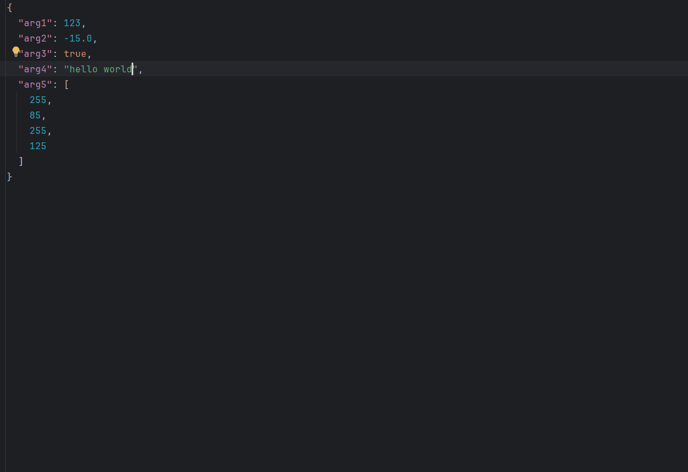

#### （二）操作停靠窗口：隐藏/显示/调整位置......

下面的例子演示了如何操作文档停靠窗口和输出停靠窗口。

主要用到了以下函数：

- set_output_dock_property()
- set_document_dock_property()
- tabify_docks()
- is_document_dock_visible()
- is_output_dock_visible()

```python
from qtpy.QtWidgets import QAction

from pyguiadapter.action import ActionConfig, Separator
from pyguiadapter.adapter import GUIAdapter
from pyguiadapter.menu import MenuConfig
from pyguiadapter.windows.fnexec import (
    FnExecuteWindow,
    BottomDockWidgetArea,
)


def dock_operation_example() -> None:
    pass


def on_toggle_document_dock(win: FnExecuteWindow, action: QAction):
    win.set_document_dock_property(visible=not win.is_document_dock_visible())


def on_toggle_output_dock(win: FnExecuteWindow, action: QAction):
    win.set_output_dock_property(visible=not win.is_output_dock_visible())


def on_tabify_docks(win: FnExecuteWindow, action: QAction):
    win.tabify_docks()


def on_move_output_area(win: FnExecuteWindow, action: QAction):
    if win.is_output_dock_floating():
        win.set_output_dock_property(floating=False)
    win.set_output_dock_property(area=BottomDockWidgetArea)


def on_float_output_dock(win: FnExecuteWindow, action: QAction):
    win.set_output_dock_property(floating=True)


def main():
    action_document_dock = ActionConfig(
        text="Toggle Document Dock",
        on_triggered=on_toggle_document_dock,
    )
    action_output_dock = ActionConfig(
        text="Toggle Output Dock",
        on_triggered=on_toggle_output_dock,
    )
    action_tabify_docks = ActionConfig(
        text="Tabify Docks",
        on_triggered=on_tabify_docks,
    )
    action_move_output_area = ActionConfig(
        text="Move Output Area",
        on_triggered=on_move_output_area,
    )
    action_float_output_dock = ActionConfig(
        text="Float Output Dock",
        on_triggered=on_float_output_dock,
    )
    menu_views = MenuConfig(
        title="Views",
        actions=[
            action_document_dock,
            action_output_dock,
            Separator(),
            action_tabify_docks,
            action_move_output_area,
            action_float_output_dock,
        ],
    )
    ##########
    adapter = GUIAdapter()
    adapter.add(dock_operation_example, window_menus=[menu_views])
    adapter.run()


if __name__ == "__main__":
    main()

```

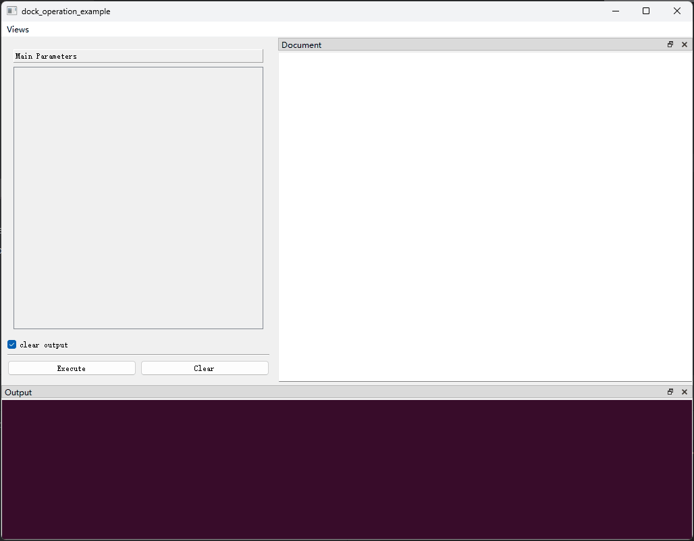
