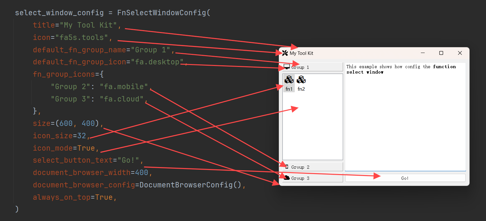

## 配置函数选择窗口

### 一、简介

在开发者向`GUIAdapter`实例中添加了多个函数后，`PyGUIAdapter`将自动生成一个`函数选择窗口`，将所有已添加的函数显示出来供用户选择。当然，开发者也可以通过如下方式，在`GUIAdapter`实例中仅添加了一个函数时强制显示该窗口：

```python
adapter.run(show_select_window=True)
```

`函数选择窗口`主要分成三个区域：

- ①`函数列表区域`
- ②`函数文档区域`
- ③`函数选择按钮`


函数列表区域用于显示已添加的函数，函数将以列表的形式分组显示。用户双击函数列表中被选中的条目或者点击`函数执行按钮`，即可打开对应函数的执行窗口。

> `PyGUIAdapter`支持函数分组功能，同一组别的函数将聚合在一个列表中显示。关于函数分组，可以参考这个文档：[添加多个函数-函数分组](adapter/multiple_functions.md?id=四、函数分组)


### 二、配置窗口属性

#### （一）可配置属性

`函数选择窗口`的可配置属性由`FnSelectWindowConfig`类定义，主要包括以下属性：

>  由于`FnSelectWindowConfig`类继承自`BaseWindowConfig`类，因此`FnSelectWindowConfig`的一些属性来源于`BaseWindowConfig`。


|        配置项名称         |                             类型                             |       默认值        |                             说明                             |
| :-----------------------: | :----------------------------------------------------------: | :-----------------: | :----------------------------------------------------------: |
|          `title`          |                            `str`                             | `"Select Function"` |                          窗口标题。                          |
|          `icon`           | `Union[str, Tuple[str, Union[list, dict]], QIcon, QPixmap, NoneType]` |       `None`        |                          窗口图标。                          |
|          `size`           |               `Union[Tuple[int, int], QSize]`                |    `(800, 600)`     |                          窗口大小。                          |
|        `position`         |              `Union[Tuple[int, int], NoneType]`              |       `None`        |                          窗口位置。                          |
|      `always_on_top`      |                       `<class 'bool'>`                       |       `False`       |                      窗口是否始终置顶。                      |
|       `font_family`       |            `Union[str, Sequence[str], NoneType]`             |       `None`        |                       窗口的字体系列。                       |
|        `font_size`        |                    `Union[int, NoneType]`                    |       `None`        |                       窗口的字体大小。                       |
|       `stylesheet`        |                    `Union[str, NoneType]`                    |       `None`        |                         窗口的样式。                         |
|   `select_button_text`    |                            `str`                             |     `"Select"`      |                       选择按钮的文本。                       |
|        `icon_mode`        |                            `bool`                            |       `False`       |           是否以图标形式显示函数，默认为列表形式。           |
|        `icon_size`        |          `Union[Tuple[int, int], QSize, NoneType]`           |     `(48, 48)`      |                       函数图标的尺寸。                       |
|  `default_fn_group_name`  |                            `str`                             |  `"Main Function"`  | 默认函数分组的名称。在添加函数到`GUIAdapter`时，若开发者未指定函数分组，则该函数将被添加的默认分组下，这个属性就是用于指定该分组的名称。 |
|  `default_fn_group_icon`  | `Union[str, Tuple[str, Union[list, dict]], QIcon, QPixmap, NoneType]` |       `None`        |                     默认函数分组的图标。                     |
|     `fn_group_icons`      | `Dict[str, Union[str, Tuple[str, Union[list, dict]], QIcon, QPixmap, NoneType]]` |        `{}`         |                     其他函数分组的图标。                     |
| `document_browser_config` |           `Union[DocumentBrowserConfig, NoneType]`           |       `None`        |                    函数文档浏览器的配置。                    |
| `document_browser_ratio`  |                           `float`                            |       `0.65`        |                函数文档浏览器区域的宽度占比。                |

`DocumentBrowserConfig`类用于配置文档浏览器，在[`pyguiadapter.windows._docbrowser.DocumentBrowserConfig`]()中定义，可以通过如下方式引入：

```python
from pyguiadapter.windows import DocumentBrowserConfig
```

`DocumentBrowserConfig`主要包含以下属性：

| 配置项名称            | 类型                        | 默认值                                | 说明                                             |
| --------------------- | --------------------------- | ------------------------------------- | ------------------------------------------------ |
| `text_color`          | `str`                       | `#000000`                             | 文本颜色。                                       |
| `font_family`         | `Union[Sequence[str], str]` | `('Consolas', 'Arial', 'sans-serif')` | 文本字体系列。                                   |
| `font_size`           | `int`                       | `12`                                  | 文本字体大小。                                   |
| `background_color`    | `str`                       | `#FFFFFF`                             | 背景颜色。                                       |
| `line_wrap_mode`      | `LineWrapMode`              | `LineWrapMode.WidgetWidth`            | 行包裹模式。                                     |
| `line_wrap_width`     | `int`                       | `88`                                  | 行包裹宽度。                                     |
| `word_wrap_mode`      | `WrapMode`                  | `WrapMode.WordWrap`                   | 词包裹模式。                                     |
| `open_external_links` | `bool`                      | `True`                                | 是否可以允许调用系统浏览器打开文档中的外部链接。 |
| `stylesheet`          | `str`                       | `""`                                  | 样式表。                                         |

#### （二）配置窗口属性的方法

开发者可以通过`GUIAdapter.run()`函数来配置`函数选择窗口（FnSelectWindow）`的窗口属性。


下面是一个完整的示例：

```python
from pyguiadapter.adapter import GUIAdapter
from pyguiadapter.windows import DocumentBrowserConfig
from pyguiadapter.windows.fnselect import FnSelectWindowConfig


def fn1():
    """
    This example shows how config the **function select window**
    """
    pass


def fn2():
    """
    This example shows how config the **function select window**
    """
    pass


def fn3():
    """
    This example shows how config the **function select window**
    """
    pass


def fn4():
    """
    This example shows how config the **function select window**
    """
    pass


if __name__ == "__main__":

    select_window_config = FnSelectWindowConfig(
        title="My Tool Kit",
        icon="fa5s.tools",
        default_fn_group_name="Group 1",
        default_fn_group_icon="fa.desktop",
        fn_group_icons={
            "Group 2": "fa.mobile",
            "Group 3": "fa.cloud",
        },
        size=(600, 400),
        icon_size=32,
        icon_mode=True,
        select_button_text="Go!",
        document_browser_ratio=0.5,
        document_browser_config=DocumentBrowserConfig(),
    )

    adapter = GUIAdapter()
    adapter.add(fn1)
    adapter.add(fn2)
    adapter.add(fn3, group="Group 2")
    adapter.add(fn4, group="Group 3")
    adapter.run(select_window_config=select_window_config)
```




### 三、添加工具栏

开发者可以向`函数选择窗口（FnSelectWindow）`中添加工具栏。


下面是一个完整的示例：

```python
from qtpy.QtWidgets import QAction

from pyguiadapter.action import ActionConfig
from pyguiadapter.adapter import GUIAdapter
from pyguiadapter.toolbar import ToolBarConfig
from pyguiadapter.windows.fnselect import FnSelectWindow
from pyguiadapter.utils import messagebox


def on_action_test(window: FnSelectWindow, action: QAction):
    messagebox.show_info_message(
        window, message=f"Action Triggered!(Action: {action.text()})"
    )


action_test = ActionConfig(
    text="Test", icon="fa.folder-open", on_triggered=on_action_test, shortcut="Ctrl+O"
)


def foo():
    pass


toolbar_config = ToolBarConfig(
    actions=[action_test],
)

if __name__ == "__main__":
    adapter = GUIAdapter()
    adapter.add(foo)
    adapter.run(show_select_window=True, select_window_toolbar=toolbar_config)

```


> 关于如何为窗口添加和配置工具栏，这篇文档里作了更为详细的说明：[为窗口添加工具栏：`ToolBarConfig`的使用](windows/toolbar.md)

### 四、添加菜单栏

开发者可以向`函数选择窗口（FnSelectWindow）`中添加菜单栏。


下面是一个完整的示例：

```python
from qtpy.QtWidgets import QAction

from pyguiadapter.action import ActionConfig, Separator
from pyguiadapter.adapter import GUIAdapter
from pyguiadapter.menu import MenuConfig
from pyguiadapter.utils import messagebox
from pyguiadapter.windows.fnselect import FnSelectWindow


def on_action_test(window: FnSelectWindow, action: QAction):
    messagebox.show_info_message(
        window, message=f"Action Triggered!(Action: {action.text()})"
    )


def on_action_close(window: FnSelectWindow, action: QAction):
    ret = messagebox.show_question_message(
        window,
        message="Are you sure to close the application?",
        buttons=messagebox.Yes | messagebox.No,
    )
    if ret == messagebox.Yes:
        window.close()


action_test = ActionConfig(
    text="Test", icon="fa.folder-open", on_triggered=on_action_test, shortcut="Ctrl+O"
)
action_close = ActionConfig(
    text="Close", icon="fa.folder-open", on_triggered=on_action_close, shortcut="Ctrl+Q"
)


menu_file = MenuConfig(
    title="File",
    actions=[action_test, Separator(), action_close],
)


def foo():
    pass


if __name__ == "__main__":
    adapter = GUIAdapter()
    adapter.add(foo)
    adapter.run(show_select_window=True, select_window_menus=[menu_file])

```


>  关于如何为窗口添加和配置菜单，这篇文档里作了更为详细的说明：[为窗口添加菜单栏：`MenuConfig`的使用](windows/menus.md)

### 五、监听窗口事件

开发者可以对`函数选择窗口（FnSelectWindow）`的事件进行监听。方法如下：


下面是一个完整的示例：

```python
from pyguiadapter.adapter import GUIAdapter
from pyguiadapter.window import SimpleWindowStateListener
from pyguiadapter.utils import messagebox
from pyguiadapter.windows.fnselect import FnSelectWindow


def on_window_create(window: FnSelectWindow):
    print("on_create")


def on_window_show(window: FnSelectWindow):
    print("on_show")


def on_window_hide(window: FnSelectWindow):
    print("on_hide")


def on_window_close(window: FnSelectWindow) -> bool:
    print("on_close")
    ret = messagebox.show_question_message(
        window,
        title="Confirm Quit",
        message="Are you sure to quit?",
        buttons=messagebox.Yes | messagebox.No,
    )
    if ret == messagebox.Yes:
        return True
    return False


def on_window_destroy(window: FnSelectWindow):
    print("on_destroy")


def event_example_3():
    pass


if __name__ == "__main__":
    event_listener = SimpleWindowStateListener(
        on_create=on_window_create,
        on_show=on_window_show,
        on_hide=on_window_hide,
        on_close=on_window_close,
        on_destroy=on_window_destroy,
    )
    adapter = GUIAdapter()
    adapter.add(event_example_3)
    adapter.run(show_select_window=True, select_window_listener=event_listener)

```


控制台输出如下：


> 关于窗口事件监听，这篇文档作了更为详细的说明：[监听窗口事件](windows/window_event.md)


