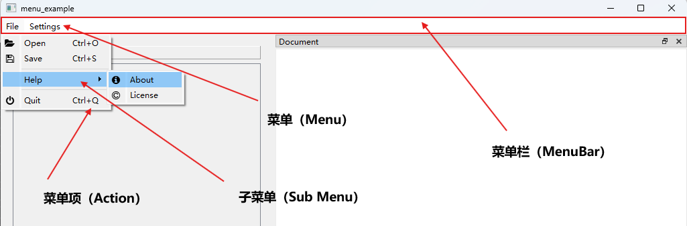
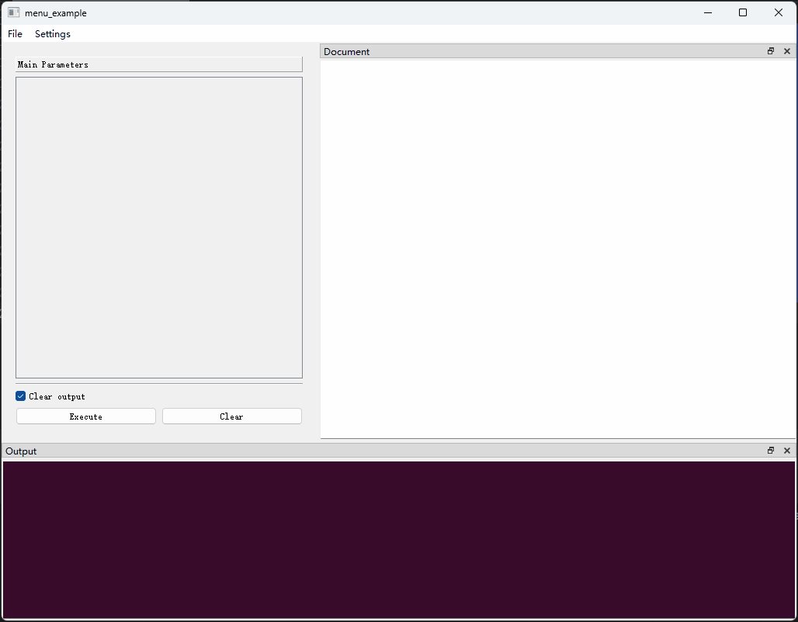
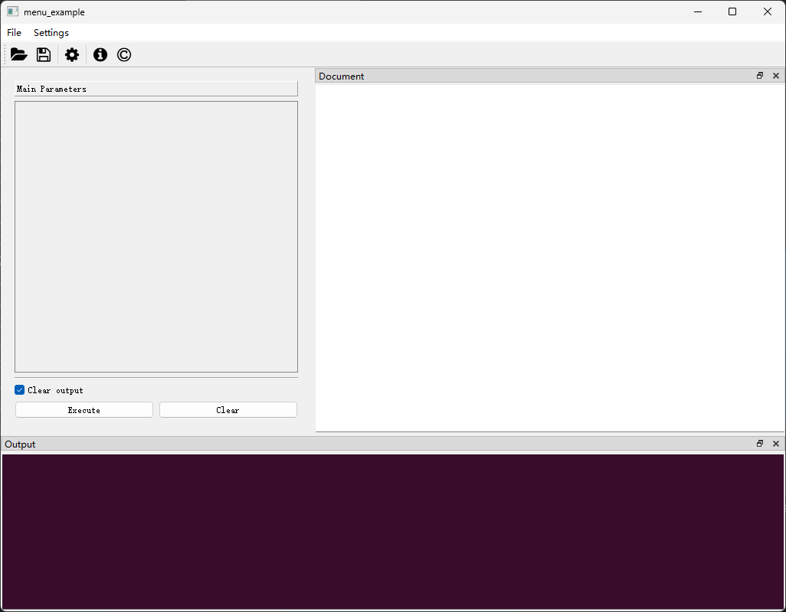
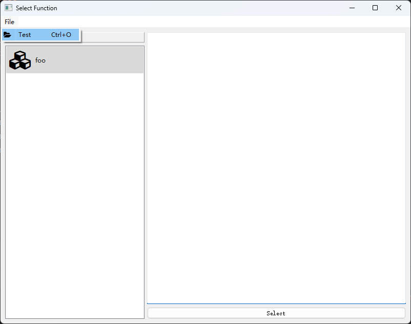

## 为窗口添加菜单栏

### 一、菜单栏的外观

菜单栏（Menu Bar）由一组菜单（Menu）组成，每个菜单下可以添加若干菜单项（Action）或子菜单（Menu）。



菜单（Menu）由`MenuConfig`类定义。菜单栏由一组`MenuConfig`，即`MenuConfig`列表定义。

### 二、菜单属性

菜单下的菜单项（或子菜单）以及菜单本身的属性由`MenuConfig`类定义，该类具有以下字段：

> `MenuConfig`在[`pyguiadapter.menu`]()模块中定义。

```python
@dataclasses.dataclass(frozen=True)
class MenuConfig(object):
    title: str
    actions: List[Union[ActionConfig, Separator, "MenuConfig"]]
    separators_collapsible: bool = True
    tear_off_enabled: bool = True
```

`title`字段用于指定菜单的名称。

`actions`字段用于指定菜单下包含的条目，可以是代表菜单项的`ActionConfig`；可以是代表分隔线的`Separator`；也可以是另外一个`MenuConfig`对象，在此情况下，被添加到`actions`的`MenuConfig`将作为当前菜单的子菜单。

> `动作（Action）`的详细说明可以参考如下文档：[使用`ActionConfig`定义`Action`](windows/action.md)


### 三、实例1：为`函数执行窗口（FnExecuteWindow）`添加菜单栏

```python
import json

from qtpy.QtWidgets import QAction

from pyguiadapter.action import ActionConfig, Separator
from pyguiadapter.adapter import GUIAdapter
from pyguiadapter.menu import MenuConfig
from pyguiadapter.utils import filedialog, inputdialog, messagebox
from pyguiadapter.window import SimpleWindowStateListener
from pyguiadapter.windows.fnexec import FnExecuteWindow


def menu_example():
    pass


###################Action Callbacks#########################
def on_action_open(window: FnExecuteWindow, action: QAction):
    print("on_action_open()")
    ret = filedialog.get_open_file(
        parent=window,
        title="Open File",
        start_dir="./",
        filters="JSON files(*.json);;All files(*.*)",
    )
    if ret:
        messagebox.show_info_message(window, f"File will be opened: {ret}")


def on_action_save(window: FnExecuteWindow, action: QAction):
    print("on_action_save()")
    ret = filedialog.get_save_file(
        parent=window,
        title="Save File",
        start_dir="./",
        filters="JSON files(*.json);;All files(*.*)",
    )
    if ret:
        messagebox.show_info_message(window, f"File will be saved to: {ret}")


def on_action_settings(window: FnExecuteWindow, action: QAction):
    default_settings = {
        "opt1": 1,
        "opt2": "2",
        "opt3": True,
    }
    new_settings = inputdialog.input_json_object(
        parent=window,
        title="Settings",
        icon="fa.cog",
        size=(600, 400),
        ok_button_text="Save",
        cancel_button_text="Cancel",
        initial_text=json.dumps(default_settings, indent=4, ensure_ascii=False),
        auto_indent=True,
        indent_size=4,
        auto_parentheses=True,
        line_wrap_mode=inputdialog.LineWrapMode.WidgetWidth,
        line_wrap_width=88,
    )
    if isinstance(new_settings, dict):
        messagebox.show_info_message(window, f"new settings: {new_settings}")


def on_action_confirm_quit(window: FnExecuteWindow, action: QAction):
    print("on_action_confirm_close(): ", action.isChecked())


def on_action_close(window: FnExecuteWindow, action: QAction):
    print("on_action_close()")
    window.close()


def on_action_about(window: FnExecuteWindow, action: QAction):
    print("on_action_about()")
    about_text = """
    <h1>PyGUIAdapter V2</h1>
    <p>PyGUIAdapter is a GUI lib for those who want make GUI application without writing GUI code!</p>
    <p>
        You can access the source code <a href="https://github.com/zimolab/PyGUIAdapter">here</a>!
    </p>
    """
    messagebox.show_text_content(
        window,
        text_content=about_text,
        text_format="html",
        title="About PyGUIAdapter",
        icon="fa.info-circle",
    )


def on_action_license(window: FnExecuteWindow, action: QAction):
    print("on_action_license()")
    license_file = "../../LICENSE.txt"
    messagebox.show_text_file(
        window,
        text_file=license_file,
        text_format="plaintext",
        title="License",
        icon="fa.copyright",
    )


###################~Action Callbacks#########################


if __name__ == "__main__":
    ###################Actions#############################
    action_open = ActionConfig(
        text="Open",
        icon="fa.folder-open",
        on_triggered=on_action_open,
        shortcut="Ctrl+O",
    )
    action_save = ActionConfig(
        text="Save",
        icon="fa.save",
        on_triggered=on_action_save,
        shortcut="Ctrl+S",
    )

    action_settings = ActionConfig(
        text="Settings",
        icon="fa.cog",
        on_triggered=on_action_settings,
        shortcut="Ctrl+,",
    )

    action_quit = ActionConfig(
        text="Quit",
        icon="fa.power-off",
        on_triggered=on_action_close,
        shortcut="Ctrl+Q",
    )
    action_confirm_quit = ActionConfig(
        text="Confirm Quit",
        icon="fa.question-circle",
        checkable=True,
        checked=False,
        on_toggled=on_action_confirm_quit,
    )
    action_about = ActionConfig(
        text="About",
        icon="fa.info-circle",
        on_triggered=on_action_about,
    )
    action_license = ActionConfig(
        text="License",
        icon="fa.copyright",
        on_triggered=on_action_license,
    )
    ###################~Actions#############################

    ####################Menus#############################
    submenu_help = MenuConfig(
        title="Help",
        actions=[action_about, action_license],
    )
    menu_file = MenuConfig(
        title="File",
        actions=[
            action_open,
            action_save,
            Separator(),
            submenu_help,
            Separator(),
            action_quit,
        ],
    )
    menu_settings = MenuConfig(
        title="Settings",
        actions=[action_settings, Separator(), action_confirm_quit],
    )

    menus = [menu_file, menu_settings]

    ###################~Menus#############################

    ################Window Event Listener###################
    def on_window_create(window: FnExecuteWindow):
        print("on_window_create()")
        # make action_confirm_quit checked after the select window is created
        window.set_action_state(action_confirm_quit, True)

    def on_window_close(window: FnExecuteWindow) -> bool:
        # get the state of action_confirm_quit
        # if it is checked, show a question message box to ask if the user really wants to close the window
        # if it is not checked, return True to close the window directly.
        state = window.query_action_state(action_confirm_quit)
        if state:
            # access the
            ret = messagebox.show_question_message(
                window,
                message="Do you really want to close the window?",
                title="Quit",
                buttons=messagebox.Yes | messagebox.No,
            )
            return ret == messagebox.Yes
        return True

    window_listener = SimpleWindowStateListener(
        on_create=on_window_create, on_close=on_window_close
    )
    #################Window Event Listener##################

    adapter = GUIAdapter()
    adapter.add(menu_example, window_menus=menus, window_listener=window_listener)
    adapter.run()

```

?


我们甚至可以同时向窗口添加工具栏和菜单栏，只需对上述代码稍作修改：

```python
...
    adapter = GUIAdapter()
    adapter.add(
        menu_example,
        window_menus=menus,
        window_toolbar=ToolBarConfig(
            actions=[
                action_open,
                action_save,
                Separator(),
                action_settings,
                Separator(),
                action_about,
                action_license,
            ]
        ),
        window_listener=window_listener,
    )
    adapter.run()
```



### 四、实例2：为`函数选择窗口（FnSelectWindow）`添加菜单栏

`函数选择窗口（FnSelectWindow）`作为`BaseWindow`的子类，同样也可以添加菜单栏，方法是在调用`adapter.run()`时传入`select_window_menus`参数。当然，别忘了将回调函数的`window`参数的类型注解改成`FnSelectWindow`。下面是一个简单的示例：

```python
from qtpy.QtWidgets import QAction

from pyguiadapter.action import ActionConfig
from pyguiadapter.adapter import GUIAdapter
from pyguiadapter.menu import MenuConfig
from pyguiadapter.utils import messagebox
from pyguiadapter.windows.fnselect import FnSelectWindow


def on_action_test(window: FnSelectWindow, action: QAction):
    messagebox.show_info_message(
        window, message=f"Action Triggered!(Action: {action.text()})"
    )


action_test = ActionConfig(
    text="Test", icon="fa.folder-open", on_triggered=on_action_test, shortcut="Ctrl+O"
)


def foo():
    pass


menu_file = MenuConfig(
    title="File",
    actions=[action_test],
)

if __name__ == "__main__":
    adapter = GUIAdapter()
    adapter.add(foo)
    adapter.run(show_select_window=True, select_window_menus=[menu_file])

```

