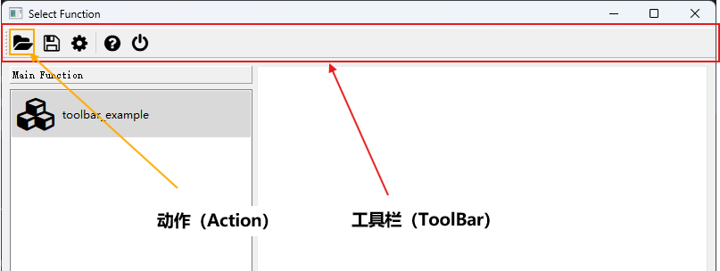

## 为窗口添加工具栏

### 一、工具栏的外观

窗口上的工具栏一般如下图所示：



### 二、工具栏属性

开发者可以使用`ToolBarConfig`来指定工具栏上的`动作（Action）`以及工具栏本身的属性。

> `ToolBarConfig`、`ToolBarArea`、`ToolButtonStyle`均在[`pyguiadapter.toolbar`]()模块中定义。

```python
@dataclasses.dataclass(frozen=True)
class ToolBarConfig(object):
    actions: List[Union[ActionConfig, Separator]]
    moveable: bool = True
    floatable: bool = True
    icon_size: Union[int, Tuple[int, int], QSize, None] = None
    initial_area: Optional[ToolBarArea] = None
    allowed_areas: ToolBarAreas = None
    button_style: Optional[ToolButtonStyle] = None
```

>  `ToolBarConfig`、`ToolBarArea`、`ToolBarAreas`、`ToolButtonStyle`均在[`pyguiadapter.toolbar`]()模块中定义。

**1、`actions`**

该字段用于指定工具栏上的`动作（Action）`。添加到工具栏上的`动作（Action）`将以动作按钮的形式呈现。工具栏上的`动作（Action）`可以设置图标（`icon`）、文字（`text`）、快捷键（`shortcut`）等属性，也可以设置`on_triggered`（被触发时回调）、`on_toggled`（状态发生切换）等事件监听器。

> `动作（Action）`的详细说明可以参考如下文档：[使用`ActionConfig`定义`Action`](windows/action.md)

**2、`moveable`**

该字段用于表示工具栏是否可拖动。若为`True`，则用户可以将工具栏任意拖动到允许放置的位置。

**3、`floatable`**

该字段用于表示工具栏是否可以悬浮于窗口之外。

**3、`icon_size`**

该字段用于指定工具栏动作按钮图标的尺寸。

**4、`initial_area`**

该字段用于表示工具栏在窗口上的初始位置。默认值为`None`，意味由系统决定。

`ToolBarArea`包含以下常用值：

- `TopToolBarArea`（在窗口顶部放置工具栏）

- `BottomToolBarArea`（在窗口底部放置工具栏）

- `LeftToolBarArea`（在窗口左侧放置工具栏）

- `RightToolBarArea`（在窗口右侧放置工具栏）

**5、`allowed_areas`**

该字段用于表示窗口上允许工具栏停放的位置，可以是`ToolBarArea`的组合，例如：`TopToolBarArea | BottomToolBarArea`表示工具栏可以停放在窗口的顶部和底部。默认为`None`，意为工具栏可以停放在任何可停放位置。

**6、`button_style`**

工具栏上动作按钮的样式，默认为`None`，意为遵从系统设置，一般为只显示图标。

`ToolButtonStyle` 包含以下常用值：

- `ToolButtonIconOnly`（只显示图标）
- `ToolButtonTextBesideIcon`（在图标旁显示文字，即`ActionConfig`对象的`text`字段）
- `ToolButtonTextUnderIcon`（在图标下方显示文字，即`ActionConfig`对象的`text`字段）
- `ToolButtonTextOnly`（只显示文字，即`ActionConfig`对象的`text`字段）
- `ToolButtonFollowStyle`（动作按钮的样式遵循系统设置）


### 三、实例1：为`函数执行窗口（FnExecuteWindow）`添加工具栏

下面是一个简单的窗口工具栏示例，该示例演示了如何为`函数执行窗口`添加工具栏，同时也演示了如何结合`PyGUIAdapter`提供的对话框、输入框等功能，构建功能更加完整的应用程序。

```python
import json

from qtpy.QtWidgets import QAction

from pyguiadapter.action import Action, Separator
from pyguiadapter.adapter import GUIAdapter
from pyguiadapter.toolbar import (
    ToolBar,
    RightToolBarArea,
    LeftToolBarArea,
    ToolButtonTextUnderIcon,
    TopToolBarArea,
)
from pyguiadapter.utils import filedialog, inputdialog, messagebox
from pyguiadapter.window import SimpleWindowEventListener
from pyguiadapter.windows.fnexec import FnExecuteWindow


def toolbar_example():
    pass


###################Action Callbacks#########################
def on_action_open(window: FnExecuteWindow, action: QAction):
    print("on_action_open()")
    ret = filedialog.get_open_file(
        parent=window,
        title="Open File",
        start_dir="./",
        filters="JSON files(*.json);;All files(*.*)",
    )
    if ret:
        messagebox.show_info_message(window, f"File will be opened: {ret}")


def on_action_save(window: FnExecuteWindow, action: QAction):
    print("on_action_save()")
    ret = filedialog.get_save_file(
        parent=window,
        title="Save File",
        start_dir="./",
        filters="JSON files(*.json);;All files(*.*)",
    )
    if ret:
        messagebox.show_info_message(window, f"File will be saved to: {ret}")


def on_action_settings(window: FnExecuteWindow, action: QAction):
    default_settings = {
        "opt1": 1,
        "opt2": "2",
        "opt3": True,
    }
    new_settings = inputdialog.input_json_object(
        parent=window,
        title="Settings",
        icon="fa.cog",
        size=(600, 400),
        ok_button_text="Save",
        cancel_button_text="Cancel",
        initial_text=json.dumps(default_settings, indent=4, ensure_ascii=False),
        auto_indent=True,
        indent_size=4,
        auto_parentheses=True,
        line_wrap_mode=inputdialog.LineWrapMode.WidgetWidth,
        line_wrap_width=88,
    )
    if isinstance(new_settings, dict):
        messagebox.show_info_message(window, f"new settings: {new_settings}")


def on_action_confirm_quit(window: FnExecuteWindow, action: QAction):
    print("on_action_confirm_close(): ", action.isChecked())


def on_action_close(window: FnExecuteWindow, action: QAction):
    print("on_action_close()")
    window.close()


###################~Action Callbacks#########################


if __name__ == "__main__":
    ###################Actions#############################
    action_open = Action(
        text="Open",
        icon="fa.folder-open",
        on_triggered=on_action_open,
        shortcut="Ctrl+O",
    )
    action_save = Action(
        text="Save",
        icon="fa.save",
        on_triggered=on_action_save,
        shortcut="Ctrl+S",
    )

    action_settings = Action(
        text="Settings",
        icon="fa.cog",
        on_triggered=on_action_settings,
        shortcut="Ctrl+,",
    )

    action_quit = Action(
        text="Quit",
        icon="fa.power-off",
        on_triggered=on_action_close,
        shortcut="Ctrl+Q",
    )
    action_confirm_quit = Action(
        text="Confirm Quit",
        icon="fa.question-circle",
        checkable=True,
        checked=False,
        on_toggled=on_action_confirm_quit,
    )
    ###################~Actions#############################

    ####################ToolBar#############################
    toolbar = ToolBar(
        actions=[
            action_open,
            action_save,
            action_settings,
            Separator(),
            action_confirm_quit,
            action_quit,
        ],
        moveable=True,
        floatable=True,
        initial_area=RightToolBarArea,
        allowed_areas=RightToolBarArea | LeftToolBarArea | TopToolBarArea,
        button_style=ToolButtonTextUnderIcon,
    )


    ###################~ToolBar#############################

    ################Window Event Listener###################
    def on_window_create(window: FnExecuteWindow):
        print("on_window_create()")
        # make action_confirm_quit checked after the select window is created
        window.set_action_state(action_confirm_quit, True)


    def on_window_close(window: FnExecuteWindow) -> bool:
        # get the state of action_confirm_quit
        # if it is checked, show a question message box to ask if the user really wants to close the window
        # if it is not checked, return True to close the window directly.
        state = window.get_action_state(action_confirm_quit)
        if state:
            # access the
            ret = messagebox.show_question_message(
                window,
                message="Do you really want to close the window?",
                title="Quit",
                buttons=messagebox.Yes | messagebox.No,
            )
            return ret == messagebox.Yes
        return True


    window_listener = SimpleWindowEventListener(
        on_create=on_window_create, on_close=on_window_close
    )
    #################Window Event Listener##################

    adapter = GUIAdapter()
    adapter.add(
        toolbar_example, window_toolbar=toolbar, window_listener=window_listener
    )
    adapter.run()

```


### 四、实例2：为`函数选择窗口（FnSelectWindow）`添加工具栏
`函数选择窗口（FnSelectWindow）`作为`BaseWindow`的子类，同样也可以添加工具栏。方法是在调用`adapter.run()`时传入`select_window_toolbar`参数。当然，别忘了将回调函数的`window`参数的类型注解改成`FnSelectWindow`。下面是一个简单的示例：

```python
from qtpy.QtWidgets import QAction

from pyguiadapter.action import Action
from pyguiadapter.adapter import GUIAdapter
from pyguiadapter.toolbar import ToolBar
from pyguiadapter.windows.fnselect import FnSelectWindow
from pyguiadapter.utils import messagebox


def on_action_test(window: FnSelectWindow, action: QAction):
    messagebox.show_info_message(
        window, message=f"Action Triggered!(Action: {action.text()})"
    )


action_test = Action(
    text="Test", icon="fa.folder-open", on_triggered=on_action_test, shortcut="Ctrl+O"
)


def foo():
    pass


toolbar_config = ToolBar(
    actions=[action_test],
)

if __name__ == "__main__":
    adapter = GUIAdapter()
    adapter.add(foo)
    adapter.run(show_select_window=True, select_window_toolbar=toolbar_config)

```

