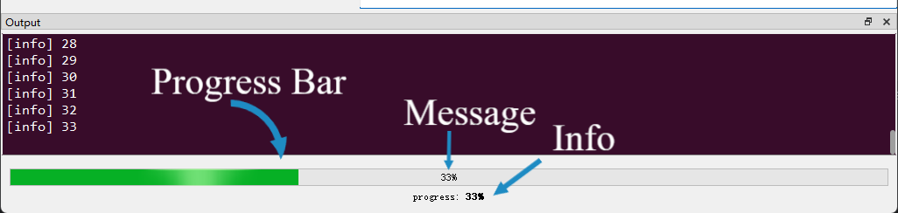
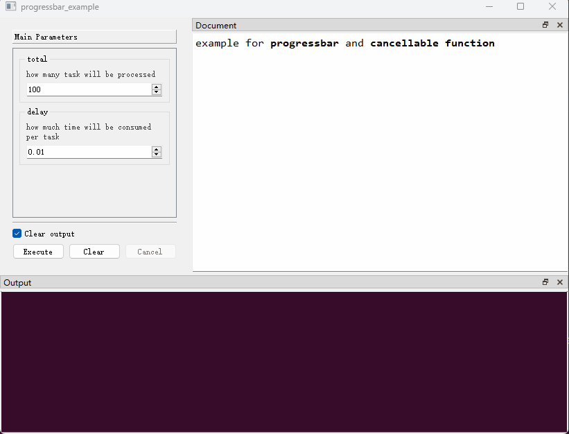

## （一）概述

`PyGUIAdapter`提供了进度条功能，开发者可以在函数执行过程中显示、隐藏和更新进度条。

进度条位于函数执行窗口`Ouput Dock`中，在输出浏览器下方，主要包括三个部分：

<div style="text-align: center">
    
</div>

- **Progress Bar**：进度条本体。

- **Message**：进度条上显示的进度信息。

- **Info**：额外显示的信息。

  

相关的API在[`pyguiadapter.adapter.uprogress`]({{main_branch}}/pyguiadapter/adapter/uprogress.py)模块中，主要包含以下三个接口：


- **`show_progressbar()`**：用于显示进度条。

- **`hide_progressbar()`**：用于隐藏进度条。

- **`update_progress()`**：用于更新进度信息和额外显示的信息。

各个函数具体信息可以参考以下文档：

- [**pyguiadapter.adapter.uprogress**](apis/pyguiadapter.adapter.uprogress.md)


## （二）示例

```python
import time

from pyguiadapter.adapter import GUIAdapter, udialog
from pyguiadapter.adapter import uprogress
from pyguiadapter.adapter.ucontext import is_function_cancelled, uprint


def progressbar_example(total: int = 100, delay: float = 0.5):
    """
    example for **progressbar** and **cancellable function**

    @param total: how many task will be processed
    @param delay: how much time will be consumed per task
    @return:
    """
    uprogress.show_progressbar(0, total, message_visible=True)
    cancelled = False
    task_processed = 0
    for i in range(total):
        if is_function_cancelled():
            uprint("Cancelled!")
            cancelled = True
            break
        task_processed = i + 1
        uprint(f"[Processed] {task_processed}")
        uprogress.update_progress(
            task_processed, info=f"[{task_processed}/{total}] please wait..."
        )
        time.sleep(delay)
    if cancelled:
        udialog.show_warning_messagebox(
            f"{task_processed} task(s) processed!", title="Cancelled"
        )
    else:
        udialog.show_info_messagebox(
            f"{task_processed} task(s) processed!", title="Completed"
        )
    uprogress.hide_progressbar()


if __name__ == "__main__":
    adapter = GUIAdapter()
    adapter.add(progressbar_example, cancelable=True)
    adapter.run()

```

效果如下：

<div style="text-align: center">
    
</div>

