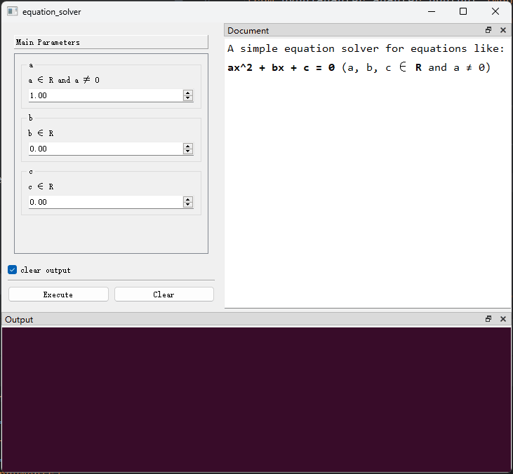

## （一）前置条件

要使用`PyGUIAdapter`开发应用程序，需满足以下条件：

+ `Python`版本 >= `3.8`
+ 安装`PyGUIAdapter`
+ 安装Qt的绑定库之一，可选：`PyQt5`、`PyQt6`、`PySide2`、`PySide6`

## （二）安装依赖

1、安装`PyGUIAdapter`

```shell
pip install PyGUIAdapter
```

2、安装Qt的绑定库一，这里以`PySide2`为例：

```shell
pip install pyside2
```

> 如果你的环境下同时安装了多个Qt绑定库，`qtpy`默认会使用`PyQt5`(如果存在的话)。可以通过环境变量`QT_API`明确指定要使用的绑定库，可以指定以下值：
>
> + `pyqt5`
> + `pyside2`
> + `pyqt6`
> + `pyside6`
>
> 可以参见[qtpy官方说明](https://github.com/spyder-ide/qtpy)。

## （三）编写代码

### 1、实现业务逻辑，并封装为函数。

```python
from typing import Optional

from pyguiadapter.adapter.uoutput import uprint
from pyguiadapter.exceptions import ParameterError


def equation_solver(a: float = 1.0, b: float = 0.0, c: float = 0.0) -> Optional[tuple]:
    """A simple equation solver for equations like:

    **ax^2 + bx + c = 0** (a, b, c ∈ **R** and a ≠ 0)

    @param a: a ∈ R and a ≠ 0
    @param b: b ∈ R
    @param c: c ∈ R
    @return:
    """
    if a == 0:
        raise ParameterError(parameter_name="a", message="a cannot be zero!")
    uprint(f"Equation:")
    uprint(f"  {a}x² + {b}x + {c} = 0")
    delta = b**2 - 4 * a * c
    if delta < 0:
        return None
    x1 = (-b + delta**0.5) / (2 * a)
    if delta == 0:
        return x1, x1
    x2 = (-b - delta**0.5) / (2 * a)
    return x1, x2

```

### 2、为业务代码创建GUI界面

```python
from pyguiadapter.adapter import GUIAdapter
...
if __name__ == "__main__":
    adapter = GUIAdapter()
    adapter.add(equation_solver)
    adapter.run()
```

**完整代码如下：**

```python
from typing import Optional

from pyguiadapter.adapter import GUIAdapter
from pyguiadapter.adapter.uoutput import uprint
from pyguiadapter.exceptions import ParameterError


def equation_solver(a: float = 1.0, b: float = 0.0, c: float = 0.0) -> Optional[tuple]:
    """A simple equation solver for equations like:

    **ax^2 + bx + c = 0** (a, b, c ∈ **R** and a ≠ 0)

    @param a: a ∈ R and a ≠ 0
    @param b: b ∈ R
    @param c: c ∈ R
    @return:
    """
    if a == 0:
        raise ParameterError(parameter_name="a", message="a cannot be zero!")
    uprint(f"Equation:")
    uprint(f"  {a}x² + {b}x + {c} = 0")
    delta = b**2 - 4 * a * c
    if delta < 0:
        return None
    x1 = (-b + delta**0.5) / (2 * a)
    if delta == 0:
        return x1, x1
    x2 = (-b - delta**0.5) / (2 * a)
    return x1, x2


if __name__ == "__main__":
    adapter = GUIAdapter()
    adapter.add(equation_solver)
    adapter.run()
```

**界面效果如下：**

<div style="text-align:center">
    
</div>

## （四）一些说明

### 1.原理
在`PyGUIAdapter`中，函数是界面的基本单元，一个函数对应了一个窗口，函数的参数列表则定义了窗口中的控件。

在基于“`输入（Input）-处理（Process）-输出（Output）`”的程序设计模型中，`PyGUIAdapter`为开发者自动完成了“`输入（Input）`”和“`输出（Output）`”这两个环节。
因此，在绝大多数情况下，开发者唯一需要关注的就是如何实现“`处理（Process）`”环节，也就是实现程序的核心功能或者说业务逻辑。

与传统GUI编程不同，在使用`PyGUIAdapter`时，GUI创建和管理的整个过程对于开发者而言几乎是透明的，开发者基本上不会感知到这一过程的存在，这意味着，开发者
不会被`“如何创建窗口和控件”`、`“如何选择和布局控件”`、`“如何处理用户输入数据”`、`“如何响应事件”`之类细枝末节的问题分散注意力，从而将关注点始终聚焦在核心功能的实现上。

将界面与逻辑进行分离被认为是一种好实践，`PyGUIAdapter`这种设计模式进一步探索了界面与逻辑分离的可能性。 那么，`PyGUIAdapter`是如何做到这一点的呢？

`PyGUIAdapter`实现实际上并不复杂，没有所谓的“黑魔法”，全部基于Python现有特性，主要包括：

- **类型注解（type hint）**
- **内醒与反射机制**
- **文档字符串（docstring）**

在运行时，`PyGUIAdapter`会获取函数参数列表，并根据参数的类型、默认值等，自动选择最合适控件。
> 例如：对于`int`类型的参数，将默认创建`IntSpinBox`；对于`str`类型的参数，将默认创建`LineEdit`等。 

同时，`PyGUIAdapter`还将从函数的签名、文档字符串等处，充分挖掘函数的信息，并基于此自完成窗口创建、界面布局和事件绑定等工作。当用户点击`Execute`按钮时，
`PyGUIAdapter`将从控件中收集用户输入数据，并对这些数据进行必要转换和处理，之后，将其作为对应参数调用函数，获取函数调用的结果并处理可能发生的异常。

> `PyGUIAdapter`充分利用了Python的类型注解机制。在`PyGUIAdapter`中，函数参数的类型注解不是可有可无的，它是生成参数控件的决定因素之一。
> 虽然并非说不使用类型注解就完全无法利用`PyGUIAdapter`——`PyGUIAdapter`也允许开发者手动为每个参数显式地指定控件——但是，这样会在很大程度上会失去
> 使用`PyGUIAdapter`的意义。所以，**强烈建议开发者养成使用类型注解的习惯。**。

### 2. 参数校验与异常处理

程序运行时的错误或者异常，很多时候根源在于`未经校验的用户输入`。在编写程序时，不要做一个乐观主义者，总是抱着“用户会按照预想的方式使用我的程序”将会成为混乱之始，
要多想想那些**“最坏”**的情况，也就是所谓的**“边界条件”**。**“永远不要相信用户的输入”**可以避免很多问题（或者说绝大部分问题），对用户输入进行校验，
尽可能过滤那些“非法”的值是增强程序健壮性的关键所在。 

因此，`PyGUIAdapter`不仅鼓励开发者对函数参数（也就是用户输入）进行校验，并且为此提供了一种简单且符合直觉的处理机制。 在上述的示例代码中，有这样几行代码，
展示了参数校验的基本方式：
```python
    ...
    if a == 0:
        raise ParameterError(parameter_name="a", message="a cannot be zero!")
    ...
```

对于非法的函数参数，开发者只需抛出`ParameterError`异常，就完成了函数参数的校验工作。`PyGUIAdapter`将自动处理后续的工作。


### 3.描述性文字
