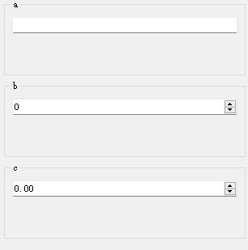
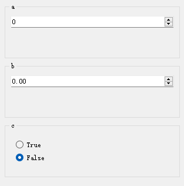
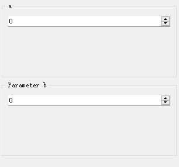
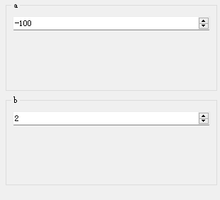

### 一、什么决定了函数参数的控件类型？

#### （一）一般规则：函数参数类型信息

一般而言，函数参数所对应的输入控件由该参数的数据类型决定，而函数参数的类型则主要由Python类型标注确定。

```python
def f1(a: str, b: int, c: float):
    pass
```

例如，在上面的函数`f1`中，参数`a`、`b`、`c`的类型分别被标注为`str`、`int`、`float`。在运行时，`PyGUIAdapter`将读取这一信息，分别为`a`、`b`、`c`生成`LineEdit`、`IntSpinBox`、`FloatSpinBox`，作为其输入控件。

<div style="text-align: center">
    
</div>


在`PyGUIAdapter`内部，实现了一套映射机制，可以将特定的数据类型与特定的控件类型关联起来，在判断应当为某个函数参数生成何种类型的控件时，只需按图索骥即可。因此，正确地为函数的参数标注数据类型至关重要，对于`PyGUIAdapter`而言，函数参数的类型标注不是那种可有可、无锦上添花的东西！

> `PyGUIAdapter`除了从函数参数的类型注解中获取参数的数据类型信息，它还实现了一些`“类型推断”`机制。比如，可以从函数参数的默认值推断出其类型。
>
> ```python
> def f2(a=10, b=0.5, c="hello", e=True, f=(1, 2, 3)):
>  pass
> ```
>
> <div style="text-align: center">
>     
> </div>
>
> 
>
> 或者，可以通过文档字符串(`docstring`)中参数的描述推断其类型。比如在下面的代码片段中，使用文档字符串中描述了函数`f3()`各个参数的类型信息：
>
> ```python
> def f3(a, b, c):
>  """
>  这是一个示例函数.
> 
>  Args:
>      a (int): 参数a的描述.
>      b (str): 参数b的描述.
>      c (list): 参数c的描述.
> 
>  Returns:
>      bool: 函数返回的结果描述.
>  """
>  pass
> ```
>
> <div style="text-align: center">
>     
> </div>
>
> 
>
> 但是，必须要指出的是，**所谓的`“类型推断”`机制仅仅是一种辅助的手段，并不总是准确，也不保证可靠，通过类型标注语法准确、情形、无歧义地指明函数参数的类型，永远是更优的选择。**


`PyGUIAdapter`已经为Python中常用数据类型实现了对应的输入控件，能够覆盖绝大多数需求。因此，一般情况下，开发者的主要工作就是正确地标注函数各个参数的类型，这是许多Python程序员已经习惯的做法。


> 关于`PyGUIAdapter`支持的数据类型及其所对应的控件，可以参考：[**控件与参数数据类型**](widget-map.md)。。
>
> 

当然，如果开发者需要将某个复杂的自定义数据类型作为参数，而内置的控件又无法满足需求，那么`PyGUIAdapter`也提供了`自定义控件`接口，并且允许开发者在自定义数据类型与自定义控件之间建立映射关系，这意味着，开发者可以像使用内置控件一样使用自定义控件。

> 关于如何实现自定义控件，可以参考：[这篇文档](widgets/custom_widget.md)。


#### （二）例外规则：手动指定参数的控件类型

虽然`PyGUIAdapter`推荐开发者使用类型注解来确定函数参数的控件类型，但并不强制这么做。`PyGUIAdapter`提供了手动指定函数参数控件类型的方法。其中，最简单的一种方法是在调用`GUIAdapter.add()`函数时，通过`widget_configs`参数指定参数的`控件配置类`。

每种类型的控件都有一个与之关联的`控件配置类`，控件配置类中不仅定义了控件类的属性，而且包含控件类本身的信息，也就是说，通过`控件配置类`可以获取其关联的控件类（当然反过来也成立，通过控件类我们也可以访问到其关联的配置类）。

<div style="text-align:center">
    
</div>

> 例如，`IntSpinBox`控件类与其配置类`IntSpinBoxConfig`的关系如下：
>
> - `IntSpinBox.ConfigClass` == `IntSpinBoxConfig`
> - `IntSpinBoxConfig.target_widget_class()` == `IntSpinBox`
>
> <div style="text-align: center">
>    
> </div>


这意味着，当开发者指定了某个参数的`控件配置类对象`，那么他实际上也就同时指定了该参数所使用的控件的类型。


比如，在下面的例子中，函数`foo()`的参数`a`、`b`、`c`虽然没有通过类型注解语法标注类型信息，但由于分别为它们指定了配置类对象：`IntSpinBoxConfig`、`FloatSpinBoxConfig`、`BoolBoxConfig`，这使得`PyGUIAdapter`也能够为其创建对应的控件——参数`a`、`b`、`c`将分别使用`IntSpinBox`、`FloatSpinBox`、`BoolBox`作为其控件。

```python
from pyguiadapter.adapter import GUIAdapter
from pyguiadapter.widgets import IntSpinBoxConfig, FloatSpinBoxConfig, BoolBoxConfig


def foo(a, b, c):
    pass


configs = {
    "a": IntSpinBoxConfig(),
    "b": FloatSpinBoxConfig(),
    "c": BoolBoxConfig(),
}

adapter = GUIAdapter()
adapter.add(foo, widget_configs=configs)
adapter.run()

```

<div style="text-align: center">
   
</div>


除了在代码里指定参数的控件配置，也可以利用`PyGUIAdapter`提供了另一个机制做到这一点：**`PyGUIAdapter`将函数文档字符串（docstring）中`@params`标记与`@end`标记之间的文本块视为该函数的控件配置区，在该区域中，开发者可以使用TOML语法配置函数参数的控件类型及其属性。**

```python
from pyguiadapter.adapter import GUIAdapter

def bar(a, b, c):
    """
    bar
    @param a:
    @param b:
    @param c:
    @return:

    @params
    [a]
    widget_class = "IntSpinBox"

    [b]
    widget_class = "FloatSpinBox"

    [c]
    widget_class = "BoolBox"

    @end
    """
    pass

adapter = GUIAdapter()
adapter.add(bar)
adapter.run()
```

<div style="text-align: center">
   
</div>

如果开发者在`@params-@end`中配置了参数的控件，同时又向`GUIAdapter.run()`传入了`widget_configs`，那么`PyGUIAdapter`会将两处配置合并，对于发生冲突的属性，将以`widget_configs`中设置的为准。

### 二、配置的控件属性

 控件属性控制着控件的外观和行为，不同类型的控件既共享部分共有的属性，也拥有各自专属的属性。

> 例如：
>
> - 所有类型的控件`default_value`、`label`、`description`、`default_value_description`、`group`
>
> 、`stylesheet`等属性；
>
> - `IntSpinBox`额外定义了`min_value`、`display_integer_base`等属性；
> - `BoolBox`额外定义了`true_text`、`false_text`等属性；
> - `LineEdit`额外具有`echo_mode`、`placeholder`等属性；
> - ......


控件的属性定义在控件对应的配置类中，其中，公共属性来自共同的父类（基类）`BaseParameterWidgetConfig`，而独有属性则在各配置类子类中定义。

<div style="text-align: center">
   
</div>

对控件属性进行配置，可以实现更加精细化的控制，比如：设置数字输入的上下限，设置文本框的输入掩码等等。很多时候，合适的配置不仅可以提高用户体验，还可以增强程序的健壮性。

> 为什么合理配置控件属性能增强程序的健壮性？
>
> 其实很好理解，如果能够提前将用户的输入值限定在某个特定的范围内，就可以在一定程度上避免出现那个著名的程序员笑话里的场景：“一个顾客走进一间酒吧，一切都运行正常，直到他点了一份炒饭......”。
>
> 

在本文的第一部分其实已经演示过配置参数控件属性的方法，只不过当时讨论的重心是如何手动指定参数控件的类型。下面，让我们聚焦参数控件属性的配置。

#### （一）使用配置类对象配置控件属性

开发者可以通过向`GUIAdapter.run()`函数传入`widget_configs`来实现控件属性的配置。

##### 1、使用配置类对象

>  实际上，传入配置类对象的同时也指定了参数控件的类型，也就是说，在这种情况下，参数的控件将不再由其类型注解决定。因此，开发者应当注意避免函数参数的类型注解与其配置类对象不兼容的情况（这种不兼容主要是指语义上的不兼容，比如：为类型标注为`int`的参数指定一个`LineEditConfig`类型的对象，这会把该参数的控件变成一个输入`str`的单行文本输入框）。
>

```python
from pyguiadapter.adapter import GUIAdapter
from pyguiadapter.widgets import (
    IntSpinBoxConfig,
    SliderConfig,
    TextEditConfig,
)


def foo(a: int, b: int, c: str = "hello world!"):
    pass


foo_configs = {
    "a": IntSpinBoxConfig(
        default_value=1,
        min_value=0,
        max_value=10,
        step=1,
        label="a",
        description="parameter a",
    ),
    "b": SliderConfig(
        default_value=50,
        min_value=0,
        max_value=100,
        label="b",
        description="parameter b",
    ),
    "c": TextEditConfig(
        default_value="Hello PyGUIAdapter!",
        label="c",
        description="parameter c",
    ),
	}

adapter = GUIAdapter()
adapter.add(foo, widget_configs=foo_configs)
adapter.run()
```

<div style="text-align: center">
   
</div>

##### 2、使用配置项字典

使用配置项字典与上一种方法本质上是等价的，只不过在这种情况下，`PyGUIAdapter`会首先确定参数控件的类型（通过参数的类型注解），然后获取对应的配置类，最后用配置项字典实例化该配置类得到配置类的对象。

```python
from pyguiadapter.adapter import GUIAdapter

def foo2(a: int, b: int, c: str = "hello world!"):
    pass

foo2_configs = {
    "a": {
        "default_value": 1,
        "min_value": 0,
        "max_value": 10,
        "step": 1,
        "label": "a",
        "description": "parameter a",
    },
    "b": {
        "default_value": 50,
        "min_value": 0,
        "max_value": 100,
        "label": "b",
        "description": "parameter b",
    },
    "c": {
        "default_value": "Hello PyGUIAdapter!",
        "label": "c",
        "description": "parameter c",
    },
}


adapter = GUIAdapter()
adapter.add(foo2, widget_configs=foo2_configs)
adapter.run()
```

<div style="text-align: center">
   
</div>

#### （二）在`@params-@end`块中配置控件属性

前文提过，**`PyGUIAdapter`将函数文档字符串（docstring）中`@params`标记与`@end`标记之间的文本块视为该函数的控件配置区，在该区域中，开发者可以使用TOML语法配置该函数的参数控件类型及其属性。**

开发者可以在`@params-@end`块中同时指定参数的控件类型及其属性：

```python
from pyguiadapter.adapter import GUIAdapter


def foo(a: int, b: int, c: str = "hello world!"):
    """
    foo
    @params
    [a]
    widget_class="IntSpinBox"
    default_value=1
    min_value=0
    max_value=10
    step=1
    label="a"
    description="parameter a"

    [b]
    widget_class="Slider"
    default_value=50
    min_value=0
    max_value=100
    label="b"
    description="parameter b"

    [c]
    widget_class="TextEdit"
    default_value="Hello PyGUIAdapter!"
    label="c"
    description="parameter c"
    @end
    """


adapter = GUIAdapter()
adapter.add(foo)
adapter.run()
```

<div style="text-align: center">
   
</div>


也可以仅指定控件的属性，将控件的类型交由类型注解决定：

```python
from pyguiadapter.adapter import GUIAdapter

def foo(a: int, b: int, c: str = "hello world!"):
    """
    @params
    [a]
    default_value=1
    min_value=0
    max_value=10
    step=1
    label="a"
    description="parameter a"

    [b]
    default_value=50
    min_value=0
    max_value=100
    label="b"
    description="parameter b"

    [c]
    default_value="Hello PyGUIAdapter!"
    label="c"
    description="parameter c"
    @end
    """


adapter = GUIAdapter()
adapter.add(foo)
adapter.run()

```

<div style="text-align: center">
   
</div>

#### （三）特殊控件属性

有几个特殊的控件属性，若开发者未对这些属性进行配置，`PyGUIAdapter`将尝试从其他地方获取合适的值。

##### 1、label

如果开发者未指定控件的`label`，则`PyGUIAdapter`将使用参数的名称作为其`label`。

```python
from pyguiadapter.adapter import GUIAdapter


def foo(a: int, b: int):
    """
    @params
    [b]
    label = "Parameter b"
    @end
    """
    pass

adapter = GUIAdapter()
adapter.add(foo)
adapter.run()
```

<div style="text-align: center">
   
</div>

##### 2、default_value

如果开发者未指定控件的`default_value`属性，那么`PyGUIAdapter`将尝试从函数签名中获取参数的默认值作为`default_value`属性的值

```python
from pyguiadapter.adapter import GUIAdapter


def foo(a: int = -100, b: int = 1 + 1):
    pass


adapter = GUIAdapter()
adapter.add(foo)
adapter.run()
```

<div style="text-align: center">
   
</div>

##### 3、description

如果开发者未指定控件的`description`属性，那么`PyGUIAdapter`将尝试从函数的文档字符串（docstring）中获取参数的描述信息作为`description`属性的值。

> 支持多种风格的docstring，包括： ReST、Google、Numpydoc-style 、Epydoc 

```python
from pyguiadapter.adapter import GUIAdapter


def foo(a: int = -100, b: int = 1 + 1):
    """
    @param a: this is parameter a
    @param b: this is parameter b
    @return:
    """


adapter = GUIAdapter()
adapter.add(foo)
adapter.run()
```

<div style="text-align: center">
   
</div>

### 三、总结

`PyGUIAdapter`内置了丰富的参数控件，并且建立了一种简单从数据类型到控件类型映射机制。开发者只需使用类型标注语法为函数参数标注正确的类型，`PyGUIAdapter`就能自动为其生成合适的输入控件。

与此同时，`PyGUIAdapter`充分考虑到了开发者的自定义需求，为开发者提供了多种配置控件属性的机制。通过对参数控件的合理配置，开发者不仅可以构建用户体验更加友好的GUI应用程序，而且可以增强程序的健壮性。

